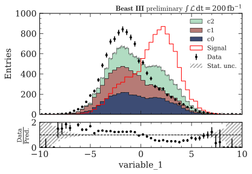

.. _advanced-advanced_examples-label:

=================
Advanced examples
=================

Setting style
=============

``import plothist`` automatically sets the matplotlib style to a presentation-ready style, with large and readable axis labels and legend.

To have a publication-ready plotting style, you can use:

.. code-block:: python

    from plothist import set_style
    set_style("publication")

You can also set both styles in the same script:

.. code-block:: python

    from plothist import set_style
    set_style("publication")
    fig, ax = ...

    set_style("presentation")
    fig, ax = ...

For the first hep example in :ref:`advanced-hep_examples-label`:

Presentation style:

.. image:: ../img/hep_examples_dataMC_stacked.svg
   :alt: Presentation style
   :width: 500

Publication style:

Color palette
=============

When displaying quantities such as yields or intensities, it is recommended to utilize Perceptually Uniform Sequential Colormaps like the cubehelix colormap for accurate representation.

We provide the ``cubehelix_palette()`` (see `here <https://plothist.readthedocs.io/en/latest/documentation/documentation.html#plothist.plotters.cubehelix_palette>`_) function to create such colormap.

.. code-block:: python

   from plothist import cubehelix_palette

   palette = cubehelix_palette(11)

.. image:: ../img/adv_cubehelix.svg
   :alt: Presentation style
..    :width: 500