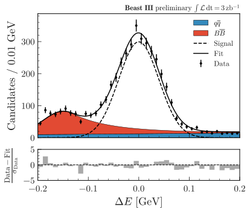
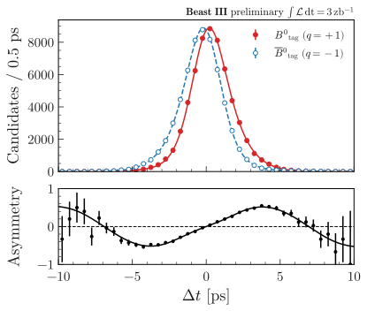

.. _advanced-hep_examples-label:

============
HEP examples
============

The examples below make use of a pandas dataframe ``df`` containing dummy data, that can be generated with:

.. code-block:: python

    from plothist.generate_dummy_data import generate_dummy_data
    df = generate_dummy_data()

Compare data and MC
===================

Stacked histograms
------------------

To make simple data/MC comparison with different MC categories:

.. code-block:: python

    from plothist import make_hist
    from plothist import get_color_palette

    # Define the histograms

    key = "variable_1"
    range = [-9, 12]
    category = "category"

    # Define masks
    signal_mask = df[category] == 7
    data_mask = df[category] == 8

    background_categories = [0, 1, 2]
    background_categories_labels = [f"c{i}" for i in background_categories]
    background_categories_colors = get_color_palette("cubehelix", len(background_categories))

    background_masks = [df[category] == p for p in background_categories]

    # Make histograms

    data_hist = make_hist(df[key][data_mask], bins=50, range=range, weights=1)
    background_hists = [
        make_hist(df[key][mask], bins=50, range=range, weights=1)
        for mask in background_masks
    ]
    signal_hist = make_hist(df[key][signal_mask], bins=50, range=range, weights=1)

    # Optional: scale to data
    background_scaling_factor = data_hist.sum().value / sum(background_hists).sum().value
    background_hists = [background_scaling_factor * h for h in background_hists]

    signal_scaling_factor = data_hist.sum().value / signal_hist.sum().value
    signal_hist *= signal_scaling_factor

Then, to create stacked histogram:

.. code-block:: python

    from plothist import compare_data_mc, add_luminosity

    fig, ax_main, ax_comparison = compare_data_mc(
        data_hist=data_hist,
        mc_hist_list=background_hists,
        signal_hist=signal_hist,
        xlabel=key,
        ylabel="Entries",
        mc_labels=background_categories_labels,
        mc_colors=background_categories_colors
    )
    add_luminosity(collaboration="Beast III", ax=ax_main, lumi=200, preliminary=True)

    fig.savefig("hep_examples_dataMC_stacked.svg", bbox_inches='tight')

.. image:: ../img/hep_examples_dataMC_stacked.svg
   :alt: Data/MC comparison, stacked plot
   :width: 500

Unstacked histograms
--------------------

or unstacked histogram:

.. code-block:: python

    from plothist import compare_data_mc, add_luminosity

    fig, ax_main, ax_comparison = compare_data_mc(
        data_hist=data_hist,
        mc_hist_list=background_hists,
        xlabel=key,
        ylabel="Entries",
        mc_labels=background_categories_labels,
        mc_colors=background_categories_colors,
        comparison_ylim=(0.5, 1.5),
        stacked=False # <--
    )
    add_luminosity(collaboration="Beast III", ax=ax_main, lumi=50, lumi_unit="zb")

    fig.savefig("hep_examples_dataMC_unstacked.svg", bbox_inches='tight')

.. image:: ../img/hep_examples_dataMC_unstacked.svg
   :alt: Data/MC comparison, stacked plot
   :width: 500

Pull comparison
---------------

To use pulls instead of the ratio to compare the histograms:

.. code-block:: python

    from plothist import compare_data_mc, add_luminosity

    fig, ax_main, ax_comparison = compare_data_mc(
        data_hist=data_hist,
        mc_hist_list=background_hists,
        xlabel=f"${key}\,\,[TeV/c^2]$",
        ylabel="Candidates per 0.42 $TeV/c^2$",
        mc_labels=background_categories_labels,
        mc_colors=background_categories_colors,
        stacked=True,
        comparison="pull"
    )
    add_luminosity(collaboration="Beast III", ax=ax_main, lumi="(1 + 0.74)", lumi_unit="ab")

    fig.savefig("hep_examples_dataMC_pull.svg", bbox_inches='tight')

.. image:: ../img/hep_examples_dataMC_pull.svg
   :alt: Data/MC comparison with pull, stacked plot
   :width: 500

Compare data and fit
====================

Delta E plot
------------------

To make simple data/fit comparison with different fit components:

.. code-block:: python

    from plothist.pdfs import gauss, cball, expo
    import numpy as np

    # Generate the data 
    xlim = (-0.2,0.2)

    signal = gauss(mean=0,sigma=0.04)
    signal_nevt = 3000
    signal_data = signal.generate(signal_nevt,*xlim)

    background = cball(mean=-0.15,sigma=0.04,alpha=0.5,n=5)
    background_nevt = 1000
    background_data = background.generate(background_nevt,*xlim)

    continuum = expo(c=0)
    continuum_nevt = 500
    continuum_data = continuum.generate(continuum_nevt,*xlim)

    data = np.concatenate([signal_data,background_data,continuum_data])

    from plothist import compare_data_fit
    from plothist import make_hist
    from plothist import add_luminosity

    # Plot data and fit
    bins = 40
    bw = (xlim[1] - xlim[0])/bins

    data_hist = make_hist(data, bins=bins, range=xlim)

    signal_func = lambda x: bw*signal_nevt*signal.pdf(x)
    background_func = lambda x: bw*background_nevt*background.pdf(x)
    continuum_func = lambda x: bw*continuum_nevt*continuum.pdf(x)
    total_func = lambda x: signal_func(x)+background_func(x)+continuum_func(x)

    fig, ax_main, ax_comparison = compare_data_fit(
        data_hist=data_hist,
        fit_function=total_func,
        function_list=[continuum_func,background_func],
        signal_function=signal_func,
        xlabel=r'$\mathit{\Delta E}$ [GeV]',
        ylabel=r'Candidates / '+f'{bw:.2f} GeV',
        function_labels=[r"$\mathit{q\overline{q}}$",r"$\mathit{B\overline{B}}$"],
        fit_label="Fit",
        signal_label="Signal",
        data_label="Data",
        stacked=True,
    )
    add_luminosity(collaboration="Belle III", ax=ax_main, lumi=3, lumi_unit='ab', preliminary=True)
    ax_main.set_ylim(0)
    fig.savefig("hep_examples_compare_data_fit.svg",bbox_inches="tight")

Asymmetry plot
--------------

To make a simple asymmetry plot with oppositely tagged evets:

.. code-block:: python

    from plothist.pdfs import bdecay, resolution, exp_bdecay
    import numpy as np

    # generate data
    xlim = (-10,10)
    bdec = bdecay(tau=1,dm=0.5,C=0,S=0.7,omega=0.1)
    res = resolution(0,0.8)
    jpsiks = exp_bdecay(bdec,res)
    nsamples = 60000
    data_btag = jpsiks.generate(nsamples,*xlim,q=+1)
    data_bartag = jpsiks.generate(nsamples,*xlim,q=-1)

    from plothist import make_hist
    from plothist import plot_asymmetry
    from plothist import add_luminosity

    # Plot the asymmetry
    bins = 40
    bw = (xlim[1]-xlim[0])/bins
    norm = bw*nsamples

    btag_hist = make_hist(data_btag, bins=bins, range=xlim, weights=1)
    bartag_hist = make_hist(data_bartag, bins=bins, range=xlim, weights=1)

    btag_func = lambda x: norm*jpsiks.pdf(x,q=+1)
    bartag_func = lambda x: norm*jpsiks.pdf(x,q=-1)

    fig, ax_main, ax_comparison = plot_asymmetry(
        btag_hist = btag_hist,
        bartag_hist = bartag_hist,
        btag_fit = btag_func,
        bartag_fit = bartag_func,
        ylabel = r'Candidates / '+f'{bw:.1f} ps',
        xlabel = r'$\mathit{\Delta t}$ [ps]'
    )

    add_luminosity(collaboration="Belle III", ax=ax_main, lumi=3, lumi_unit='ab', preliminary=True)
    fig.savefig('asymmetry.pdf', bbox_inches="tight")

If you do not want to show and take into account the MC uncertainties, setting ``mc_uncertainty`` to ``False`` updates the definition of the pulls:

.. code-block:: python

    from plothist import compare_data_mc, add_luminosity

    fig, ax_main, ax_comparison = compare_data_mc(
        data_hist=data_hist,
        mc_hist_list=background_hists,
        xlabel=f"${key}\,\,[eV/c^2]$",
        ylabel="Hits in the LMN per $4.2\\times 10^{-1}\,\,eV/c^2$",
        mc_labels=background_categories_labels,
        mc_colors=background_categories_colors,
        stacked=True,
        comparison="pull",
        mc_uncertainty=False # <--
    )
    add_luminosity(collaboration="Beast III", ax=ax_main, lumi=8.2, lumi_unit="zb", preliminary=True)

    fig.savefig("hep_examples_dataMC_pull_no_MC_stat_unc.svg", bbox_inches='tight')

.. image:: ../img/hep_examples_dataMC_pull_no_MC_stat_unc.svg
   :alt: Data/MC comparison with pull, no MC stat. unc., stacked plot
   :width: 500

Other comparisons
-----------------

Every type of comparisons available with ``plot_comparison()`` are available for ``compare_data_mc()`` (see :ref:`basics-1d_hist_comparison-label`).

Example plot with all comparisons, using the same histograms as above:

.. code-block:: python
    from plothist import (
        create_comparison_figure,
        compare_data_mc,
        add_text,
        set_fitting_ylabel_fontsize
    )
    import matplotlib.pyplot as plt

    fig, axes = create_comparison_figure(
        figsize=(6, 11),
        nrows=5,
        gridspec_kw={"height_ratios": [3.3, 1, 1, 1, 1]},
        hspace=0.3,
    )

    fig_temp, ax_temp = plt.subplots()

    for k_comp, comparison in enumerate(["ratio", "pull", "relative_difference", "difference"], 1):

        fig_comp, ax_main, ax_comparison = compare_data_mc(
            data_hist=data_hist,
            mc_hist_list=background_hists,
            signal_hist=signal_hist,
            xlabel=key,
            ylabel="Entries",
            mc_labels=background_categories_labels,
            mc_colors=background_categories_colors,
            comparison=comparison,
            fig=fig,
            ax_main=axes[0] if k_comp == 1 else ax_temp,
            ax_comparison=axes[k_comp],
        )

        axes[k_comp].set_xlabel("")
        add_text(f'  $\mathbf{{→}}$ comparison = "{comparison}"', ax=ax_comparison, fontsize=13)
        set_fitting_ylabel_fontsize(ax_comparison)

    fig.savefig("hep_all_comparisons.svg", bbox_inches="tight")

.. image:: ../img/hep_all_comparisons.svg
   :alt: Data/MC comparison with all comparisons, stacked plot
   :width: 500

Same example plot but we remove the MC statistical uncertainties by adding ``mc_uncertainty=False`` in ``compare_data_mc()``:

.. image:: ../img/hep_all_comparisons_no_stat_MC_unc.svg
   :alt: Data/MC comparison with all comparisons, no mc uncertainties, stacked plot
   :width: 500

For ``ratio`` or ``relative_difference``, the uncertainties can be split between MC and data (default option) or both can be added to the ratio uncertainty (``ratio_uncertainty="uncorrelated"``). Here are all the possible options:

.. code-block:: python

    from plothist import (
        compare_data_mc,
        add_luminosity,
        create_comparison_figure,
        set_fitting_ylabel_fontsize,
        add_text,
        compare_two_hist,
    )
    import matplotlib.pyplot as plt

    fig, axes = create_comparison_figure(
        figsize=(6, 11),
        nrows=5,
        gridspec_kw={"height_ratios": [3.3, 1, 1, 1, 1]},
        hspace=0.3,
    )

    fig_temp, ax_temp = plt.subplots()

    for k_comp in [1, 2, 3, 4]:
        ratio_uncertainty = "uncorrelated" if k_comp % 2 == 0 else "split"
        mc_uncertainty = False if k_comp > 2 else True

        fig_comp, ax_main, ax_comparison = compare_data_mc(
            data_hist=data_hist,
            mc_hist_list=background_hists,
            signal_hist=signal_hist,
            xlabel=key,
            ylabel="Entries",
            mc_labels=background_categories_labels,
            mc_colors=background_categories_colors,
            comparison="ratio",
            fig=fig,
            ax_main=axes[0] if k_comp == 1 else ax_temp,
            ax_comparison=axes[k_comp],
            ratio_uncertainty=ratio_uncertainty,
            mc_uncertainty=mc_uncertainty,
        )
        axes[k_comp].set_xlabel("")
        add_text(
            f'  $\mathbf{{→}}$ comparison = "ratio", \n  $\mathbf{{→}}$ ratio_uncertainty="{ratio_uncertainty}", mc_uncertainty = {mc_uncertainty}',
            ax=ax_comparison,
            fontsize=10,
        )

    fig.savefig("hep_comparisons_ratio_options.svg", bbox_inches="tight")

.. image:: ../img/hep_comparisons_ratio_options.svg
   :alt: Data/MC comparison with all comparisons option for ratio
   :width: 500

Advanced
========

Flatten 2D variable
-------------------

Compare data and stacked histogram for a flatten 2D variable:

.. code-block:: python

    from plothist import make_2d_hist, get_color_palette
    from plothist import compare_data_mc, add_luminosity

    # Define the histograms

    key1 = "variable_1"
    key2 = "variable_2"
    # Bins [-10,0], [0,10] for variable 1,
    # and bins [-10,-5], [-5,0], [0,5], [5,10] for variable 2
    bins = [[-10, 0, 10], [-10, -5, 0, 5, 10]]
    category = "category"

    # Define datasets

    signal_mask = df[category] == 7
    data_mask = df[category] == 8

    background_categories = [0, 1, 2, 3, 4, 5, 6]
    background_categories_labels = [f"c{i}" for i in background_categories]
    background_categories_colors = get_color_palette("cubehelix", len(background_categories))

    background_masks = [df[category] == p for p in background_categories]

    # Make histograms

    data_hist = make_2d_hist(
        [df[key][data_mask] for key in [key1, key2]], bins=bins, weights=1
    )
    background_hists = [
        make_2d_hist([df[key][mask] for key in [key1, key2]], bins=bins, weights=1)
        for mask in background_masks
    ]
    signal_hist = make_2d_hist(
        [df[key][signal_mask] for key in [key1, key2]], bins=bins, weights=1
    )

    # Compare data and stacked histogram
    fig, ax_main, ax_comparison = compare_data_mc(
        data_hist=data_hist,
        mc_hist_list=background_hists,
        signal_hist=signal_hist,
        xlabel=rf"({key1} $\times$ {key2}) bin",
        ylabel="Entries",
        mc_labels=background_categories_labels,
        mc_colors=background_categories_colors,
        save_as=None,
        flatten_2d_hist=True, # <--
    )

    add_luminosity(collaboration="Beast III", ax=ax_main, lumi=50, lumi_unit="zb")
    ax_main.legend(ncol=3, fontsize=10, loc="upper left")

    fig.savefig("hep_examples_dataMC_flatten2D.svg", bbox_inches='tight')

.. image:: ../img/hep_examples_dataMC_flatten2D.svg
   :alt: Data/MC comparison, flatten variable
   :width: 500

