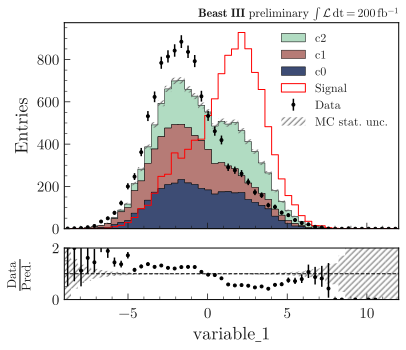

.. _advanced-hep_examples-label:

============
HEP examples
============

The examples below make use of a pandas dataframe ``df`` containing dummy data, that can be generated with:

.. code-block:: python

    from plothist.generate_dummy_data import generate_dummy_data()
    df = generate_dummy_data()

Example scripts are available in the repository in the ``example/`` folder.

Compare data and MC
===================

To make simple data/MC comparison with different MC categories:

.. code-block:: python

    from plothist import make_hist
    from plothist import cubehelix_palette

    # Define the histograms

    key = "variable_1"
    range = [-10, 10]
    category = "category"

    # Define masks
    signal_mask = df[category] == 7
    data_mask = df[category] == 8

    background_categories = [0, 1, 2]
    background_categories_labels = [f"c{i}" for i in background_categories]
    background_categories_colors = cubehelix_palette(ncolors=len(background_categories))

    background_masks = [df[category] == p for p in background_categories]

    # Make histograms

    data_hist = make_hist(df[key][data_mask], bins=50, range=range, weights=1)
    background_hists = [
        make_hist(df[key][mask], bins=50, range=range, weights=1)
        for mask in background_masks
    ]
    signal_hist = make_hist(df[key][signal_mask], bins=50, range=range, weights=1)

    # Optional: scale to data
    background_scaling_factor = data_hist.sum().value / sum(background_hists).sum().value
    background_hists = [background_scaling_factor * h for h in background_hists]

    signal_scaling_factor = data_hist.sum().value / signal_hist.sum().value
    signal_hist *= signal_scaling_factor

Then, to create stacked histogram:

.. code-block:: python

    import matplotlib.pyplot as plt
    from plothist import compare_data_mc, plot_b2_logo

    fig, ax_comparison, ax_ratio = compare_data_mc(
        data_hist=data_hist,
        mc_hist_list=background_hists,
        signal_hist=signal_hist,
        xlabel=key,
        ylabel="Entries",
        mc_labels=background_categories_labels,
        mc_colors=background_categories_colors
    )
    plot_b2_logo(ax=ax_comparison, lumi=50000)

    plt.show()

or unstacked histogram:

.. code-block:: python

    import matplotlib.pyplot as plt
    from plothist import compare_data_mc, plot_b2_logo

    fig, ax_comparison, ax_ratio = compare_data_mc(
        data_hist=data_hist,
        mc_hist_list=background_hists,
        xlabel=key,
        ylabel="Entries",
        mc_labels=background_categories_labels,
        mc_colors=background_categories_colors,
        stacked=False # <--
    )
    plot_b2_logo(ax=ax_comparison, lumi=50000)

    plt.show()

.. image:: ../img/hep_examples_dataMC_unstacked.svg
   :alt: Data/MC comparison, stacked plot
   :width: 500

Advanced
========

Flatten 2D variable
-------------------

Compare data and stacked histogram for a flatten 2D variable:

.. code-block:: python

    from plothist import make_2d_hist, cubehelix_palette
    from plothist import compare_data_mc, plot_b2_logo
    import matplotlib.pyplot as plt

    # Define the histograms

    key1 = "variable_1"
    key2 = "variable_2"
    # Bins [-10,0], [0,10] for variable 1,
    # and bins [-10,-5], [-5,0], [0,5], [5,10] for variable 2
    bins = [[-10, 0, 10], [-10, -5, 0, 5, 10]]
    category = "category"

    # Define datasets

    signal_mask = df[category] == 7
    data_mask = df[category] == 8

    background_categories = [0, 1, 2, 3, 4, 5, 6]
    background_categories_labels = [f"c{i}" for i in background_categories]
    background_categories_colors = cubehelix_palette(ncolors=len(background_categories))

    background_masks = [df[category] == p for p in background_categories]

    # Make histograms

    data_hist = make_2d_hist(
        [df[key][data_mask] for key in [key1, key2]], bins=bins, weights=1
    )
    background_hists = [
        make_2d_hist([df[key][mask] for key in [key1, key2]], bins=bins, weights=1)
        for mask in background_masks
    ]
    signal_hist = make_2d_hist(
        [df[key][signal_mask] for key in [key1, key2]], bins=bins, weights=1
    )

    # Compare data and stacked histogram
    fig, ax_comparison, ax_ratio = compare_data_mc(
        data_hist=data_hist,
        mc_hist_list=background_hists,
        signal_hist=signal_hist,
        xlabel=rf"({key1} $\times$ {key2}) bin",
        ylabel="Entries",
        mc_labels=background_categories_labels,
        mc_colors=background_categories_colors,
        save_as=None,
        flatten_2d_hist=True, # <--
    )

    plot_b2_logo(ax=ax_comparison, lumi=50000)
    ax_comparison.legend(ncol=3, fontsize=10)

    plt.show()

.. image:: ../img/hep_examples_dataMC_flatten2D.svg
   :alt: Data/MC comparison, flatten variable
   :width: 500

