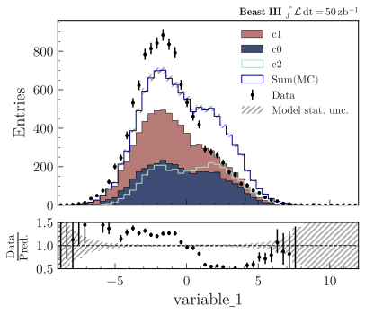
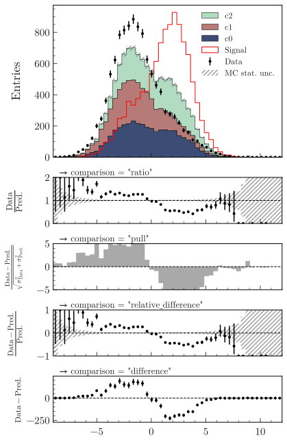
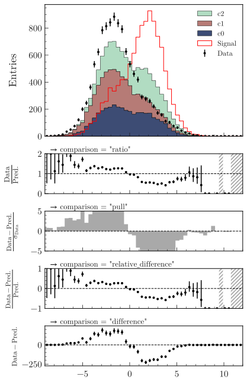
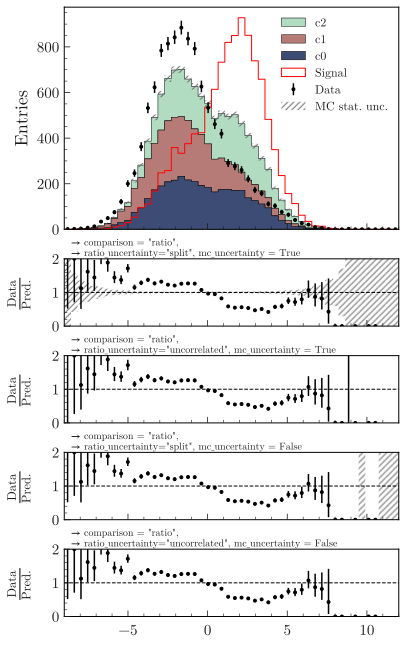

.. _advanced-model_examples-label:

=========================
Model comparison examples
=========================

The examples below make use of a pandas dataframe ``df`` containing dummy data, that can be generated with:

.. code-block:: python

    from plothist.generate_dummy_data import generate_dummy_data
    df = generate_dummy_data()

Compare data and model
======================

Stacked histograms
------------------

To make simple data/model comparison with different model categories:

.. code-block:: python

    from plothist import make_hist
    from plothist import get_color_palette

    # Define the histograms

    key = "variable_1"
    range = [-9, 12]
    category = "category"

    # Define masks
    signal_mask = df[category] == 7
    data_mask = df[category] == 8

    background_categories = [0, 1, 2]
    background_categories_labels = [f"c{i}" for i in background_categories]
    background_categories_colors = get_color_palette("cubehelix", len(background_categories))

    background_masks = [df[category] == p for p in background_categories]

    # Make histograms

    data_hist = make_hist(df[key][data_mask], bins=50, range=range, weights=1)
    background_hists = [
        make_hist(df[key][mask], bins=50, range=range, weights=1)
        for mask in background_masks
    ]
    signal_hist = make_hist(df[key][signal_mask], bins=50, range=range, weights=1)

    # Optional: scale to data
    background_scaling_factor = data_hist.sum().value / sum(background_hists).sum().value
    background_hists = [background_scaling_factor * h for h in background_hists]

    signal_scaling_factor = data_hist.sum().value / signal_hist.sum().value
    signal_hist *= signal_scaling_factor

Then, to create stacked histogram:

.. code-block:: python

    from plothist import plot_data_model_comparison, plot_hist, add_luminosity

    fig, ax_main, ax_comparison = plot_data_model_comparison(
        data_hist=data_hist,
        stacked_components= background_hists,
        stacked_labels= background_categories_labels,
        stacked_colors= background_categories_colors,
        xlabel=key,
        ylabel="Entries",
        model_uncertainty_label="MC stat. unc.",
    )

    plot_hist(
        signal_hist,
        ax=ax_main,
        color="red",
        label="Signal",
        histtype="step",
    )

    ax_main.legend()

    add_luminosity(collaboration="Beast III", ax=ax_main, lumi=200, preliminary=True)

    fig.savefig("hep_examples_dataMC_stacked.svg", bbox_inches='tight')

.. image:: ../img/hep_examples_dataMC_stacked.svg
   :alt: Data/model comparison, stacked plot
   :width: 500

Unstacked histograms
--------------------

or unstacked histogram:

.. code-block:: python

    from plothist import plot_data_model_comparison, plot_hist, add_luminosity

    fig, ax_main, ax_comparison = plot_data_model_comparison(
        data_hist=data_hist,
        unstacked_components= background_hists,
        unstacked_labels= background_categories_labels,
        unstacked_colors= background_categories_colors,
        xlabel=key,
        ylabel="Entries",
        model_uncertainty_label="MC stat. unc.",
        model_sum_kwargs={"label":"Sum(MC)", "color": "navy"},
        comparison_ylim=[0.5, 1.5],
    )

    ax_main.legend()

    add_luminosity(collaboration="Beast III", ax=ax_main, lumi=50, lumi_unit="zb")

    fig.savefig("hep_examples_dataMC_unstacked.svg", bbox_inches='tight')

.. image:: ../img/hep_examples_dataMC_unstacked.svg
   :alt: Data/model comparison, stacked plot
   :width: 500

Stacked and unnstacked histograms
---------------------------------

Stacked and unstacked histograms can be combined:

.. code-block:: python

    from plothist import plot_data_model_comparison, add_luminosity

    fig, ax_main, ax_comparison = plot_data_model_comparison(
        data_hist=data_hist,
        stacked_components=background_hists[:2],
        stacked_labels=background_categories_labels[:2],
        stacked_colors=background_categories_colors[:2],
        unstacked_components=background_hists[2:],
        unstacked_labels=background_categories_labels[2:],
        unstacked_colors=background_categories_colors[2:],
        xlabel=key,
        ylabel="Entries",
        model_sum_kwargs={"show": True, "label": "Sum(MC)", "color": "navy"},
        comparison_ylim=(0.5, 1.5),
    )
    add_luminosity(collaboration="Beast III", ax=ax_main, lumi=50, lumi_unit="zb")

    fig.savefig("hep_examples_dataMC_stacked_unstacked.svg", bbox_inches='tight')

Models made of functions
------------------------

If you want to plot only the model, use ``plot_model()``. It supports models made of functions or histograms.
Here is an example with a model above made of functions:

.. code-block:: python

    from plothist import plot_model, add_luminosity
    from scipy.stats import norm

    def f0(x):
        return 1000*norm.pdf(x, loc=-2, scale=4)
    def f1(x):
        return 3000*norm.pdf(x, loc=-2, scale=2)
    def f2(x):
        return 1000*norm.pdf(x, loc=2, scale=3)

    fig, ax = plot_model(
        stacked_components=[f0, f1],
        stacked_labels=["f0", "f1"],
        stacked_colors=background_categories_colors[:2],
        unstacked_components=[f2],
        unstacked_labels=["f2"],
        unstacked_colors=background_categories_colors[2:],
        xlabel=key,
        ylabel=f"f({key})",
        model_sum_kwargs={"show": True, "label": "Model", "color": "navy"},
        function_range=[-9,12],
    )
    add_luminosity(collaboration="Beast III", ax=ax, is_data=False)

    fig.savefig("model_with_stacked_and_unstacked_function_component.svg", bbox_inches='tight')

.. image:: ../img/model_with_stacked_and_unstacked_function_components.svg
   :alt: Plot of a model with stacked and unstacked function components
   :width: 500

The function ``plot_data_model_comparison()`` can also be used to compare data and functions:

.. code-block:: python

    from plothist import plot_data_model_comparison

    fig, ax_main, ax_comparison = plot_data_model_comparison(
        data_hist=data_hist,
        stacked_components=[f0, f1],
        stacked_labels=["f0", "f1"],
        stacked_colors=background_categories_colors[:2],
        unstacked_components=[f2],
        unstacked_labels=["f2"],
        unstacked_colors=background_categories_colors[2:],
        xlabel=key,
        ylabel="Entries",
        model_sum_kwargs={"show": True, "label": "Model", "color": "navy"},
        comparison="pull"
    )
    add_luminosity(collaboration="Beast III", ax=ax_main, lumi=50, lumi_unit="zb")

    fig.savefig("ratio_data_vs_model_with_stacked_and_unstacked_function_components.svg", bbox_inches='tight')

.. image:: ../img/ratio_data_vs_model_with_stacked_and_unstacked_function_components.svg
   :alt: Data/Model comparison, model with stacked and unstacked function components
   :width: 500

Pull comparison
---------------

To use pulls instead of the ratio to compare the histograms:

.. code-block:: python

    from plothist import plot_data_model_comparison, add_luminosity

    fig, ax_main, ax_comparison = plot_data_model_comparison(
        data_hist=data_hist,
        stacked_components=background_hists,
        stacked_labels=background_categories_labels,
        stacked_colors=background_categories_colors,
        xlabel=f"${key}\,\,[TeV/c^2]$",
        ylabel="Candidates per 0.42 $TeV/c^2$",
        comparison="pull",
        model_uncertainty_label="MC stat. unc.",
    )

    add_luminosity(collaboration="Beast III", ax=ax_main, lumi="(1 + 0.74)", lumi_unit="ab")

    fig.savefig("hep_examples_dataMC_pull.svg", bbox_inches='tight')

.. image:: ../img/hep_examples_dataMC_pull.svg
   :alt: Data/model comparison with pull, stacked plot
   :width: 500

If you do not want to show and take into account the model uncertainties, setting ``model_uncertainty`` to ``False`` updates the definition of the pulls:

.. code-block:: python

    from plothist import plot_data_model_comparison, add_luminosity

    fig, ax_main, ax_comparison = plot_data_model_comparison(
        data_hist=data_hist,
        stacked_components=background_hists,
        stacked_labels=background_categories_labels,
        stacked_colors=background_categories_colors,
        xlabel=f"${key}\,\,[eV/c^2]$",
        ylabel="Hits in the LMN per $4.2\\times 10^{-1}\,\,eV/c^2$",
        comparison="pull",
        model_uncertainty=False # <--
    )
    add_luminosity(collaboration="Beast III", ax=ax_main, lumi=8.2, lumi_unit="zb", preliminary=True)

    fig.savefig("hep_examples_dataMC_pull_no_MC_stat_unc.svg", bbox_inches='tight')

.. image:: ../img/hep_examples_dataMC_pull_no_MC_stat_unc.svg
   :alt: Data/model comparison with pull, no model stat. unc., stacked plot
   :width: 500

Other comparisons
-----------------

Example plot with all available comparisons between model and data, using the same histograms as above:

.. code-block:: python

    from plothist import (
        create_comparison_figure,
        plot_data_model_comparison,
        add_text,
        set_fitting_ylabel_fontsize,
        plot_comparison
    )
    import matplotlib.pyplot as plt

    fig, axes = create_comparison_figure(
        figsize=(6, 11),
        nrows=5,
        gridspec_kw={"height_ratios": [3.3, 1, 1, 1, 1]},
        hspace=0.3,
    )
    background_sum = sum(background_hists)

    fig, ax_main, ax_comparison = plot_data_model_comparison(
            data_hist=data_hist,
            stacked_components=background_hists,
            stacked_labels=background_categories_labels,
            stacked_colors=background_categories_colors,
            xlabel="",
            ylabel="Entries",
            model_uncertainty_label="MC stat. unc.",
            comparison="ratio",
            fig=fig,
            ax_main=axes[0],
            ax_comparison=axes[1],
        )

    plot_hist(
        signal_hist,
        ax=axes[0],
        color="red",
        label="Signal",
        histtype="step",
    )

    axes[0].legend()

    add_text(f'  $\mathbf{{→}}$ comparison = "ratio"', ax=ax_comparison, fontsize=13)

    for k_comp, comparison in enumerate(["pull", "relative_difference", "difference"], start=2):

        ax_comparison = axes[k_comp]

        plot_comparison(
            data_hist,
            background_sum,
            ax=ax_comparison,
            comparison=comparison,
            xlabel="",
            h1_label="Data",
            h2_label="Pred.",
            ratio_uncertainty="split",
            hist_1_uncertainty="asymmetrical",
        )
        add_text(f'  $\mathbf{{→}}$ comparison = "{comparison}"', ax=ax_comparison, fontsize=13)
        set_fitting_ylabel_fontsize(ax_comparison)

    axes[-1].set_xlabel(key)

    fig.savefig("hep_all_comparisons.svg", bbox_inches="tight")

Same example plot but we remove the statistical uncertainties of the model by adding ``model_uncertainty=False`` in ``plot_data_model_comparison()`` and pass a model histogram without uncertainties to ``plot_comparison()``:

.. code-block:: python

    from plothist import (
        create_comparison_figure,
        plot_data_model_comparison,
        add_text,
        set_fitting_ylabel_fontsize,
        plot_comparison
    )
    import matplotlib.pyplot as plt
    import numpy as np

    fig, axes = create_comparison_figure(
        figsize=(6, 11),
        nrows=5,
        gridspec_kw={"height_ratios": [3.3, 1, 1, 1, 1]},
        hspace=0.3,
    )
    background_sum = sum(background_hists)

    fig, ax_main, ax_comparison = plot_data_model_comparison(
            data_hist=data_hist,
            stacked_components=background_hists,
            stacked_labels=background_categories_labels,
            stacked_colors=background_categories_colors,
            xlabel="",
            ylabel="Entries",
            model_uncertainty=False, # <--
            comparison="ratio",
            fig=fig,
            ax_main=axes[0],
            ax_comparison=axes[1],
        )

    plot_hist(
        signal_hist,
        ax=axes[0],
        color="red",
        label="Signal",
        histtype="step",
    )

    axes[0].legend()

    add_text(f'  $\mathbf{{→}}$ comparison = "ratio"', ax=ax_comparison, fontsize=13)

    for k_comp, comparison in enumerate(["pull", "relative_difference", "difference"], start=2):

        ax_comparison = axes[k_comp]

        # Copy the original histogram and set the uncertainties of the copy to 0.
        background_sum_copy = background_sum.copy()
        background_sum_copy[:] = np.c_[
        background_sum_copy.values(), np.zeros_like(background_sum_copy.values())
        ]

        plot_comparison(
            data_hist,
            background_sum_copy,
            ax=ax_comparison,
            comparison=comparison,
            xlabel="",
            h1_label="Data",
            h2_label="Pred.",
            ratio_uncertainty="split",
            hist_1_uncertainty="asymmetrical",
        )
        if comparison == "pull":
            # Since the uncertainties of the model are neglected, the pull label is "(Data - Pred.)/sigma_Data"
            ax_comparison.set_ylabel(r"$\frac{Data-Pred.}{\sigma_{Data}}$")
        add_text(f'  $\mathbf{{→}}$ comparison = "{comparison}"', ax=ax_comparison, fontsize=13)
        set_fitting_ylabel_fontsize(ax_comparison)

    axes[-1].set_xlabel(key)

    fig.savefig("hep_all_comparisons_no_stat_MC_unc.svg", bbox_inches="tight")

For ``ratio`` or ``relative_difference``, the uncertainties can be split between model and data (default option) or both can be added to the ratio uncertainty (``ratio_uncertainty="uncorrelated"``). Here are all the possible options:

.. code-block:: python

    from plothist import (
        create_comparison_figure,
        plot_data_model_comparison,
        add_text,
        set_fitting_ylabel_fontsize,
        plot_comparison
    )
    import numpy as np
    import matplotlib.pyplot as plt

    fig, axes = create_comparison_figure(
        figsize=(6, 11),
        nrows=5,
        gridspec_kw={"height_ratios": [3.3, 1, 1, 1, 1]},
        hspace=0.3,
    )

    background_sum = sum(background_hists)

    fig, ax_main, ax_comparison = plot_data_model_comparison(
            data_hist=data_hist,
            stacked_components=background_hists,
            stacked_labels=background_categories_labels,
            stacked_colors=background_categories_colors,
            xlabel="",
            ylabel="Entries",
            comparison="ratio",
            ratio_uncertainty="split",
            model_uncertainty_label="MC stat. unc.",
            fig=fig,
            ax_main=axes[0],
            ax_comparison=axes[1],
        )

    plot_hist(
        signal_hist,
        ax=axes[0],
        color="red",
        label="Signal",
        histtype="step",
    )

    axes[0].legend()

    add_text(
        f'  $\mathbf{{→}}$ comparison = "ratio", \n  $\mathbf{{→}}$ ratio_uncertainty="split", model_uncertainty = True',
        ax=ax_comparison,
        fontsize=10,
    )

    for k_comp, (ratio_uncertainty, model_uncertainty) in enumerate([
        ("uncorrelated", True),
        ("split", False),
        ("uncorrelated", False),
        ], start=2):

        ax_comparison = axes[k_comp]

        # When the uncertainties on the model are neglected, copy the original histogram and set the uncertainties of the copy to 0.
        background_sum_copy = background_sum.copy()
        if not model_uncertainty:
            background_sum_copy[:] = np.c_[
            background_sum_copy.values(), np.zeros_like(background_sum_copy.values())
        ]

        plot_comparison(
            data_hist,
            background_sum_copy,
            ax=ax_comparison,
            comparison="ratio",
            xlabel="",
            h1_label="Data",
            h2_label="Pred.",
            ratio_uncertainty=ratio_uncertainty,
            hist_1_uncertainty="asymmetrical",
        )
        add_text(
            f'  $\mathbf{{→}}$ comparison = "ratio", \n  $\mathbf{{→}}$ ratio_uncertainty="{ratio_uncertainty}", model_uncertainty = {model_uncertainty}',
            ax=ax_comparison,
            fontsize=10,
        )
        set_fitting_ylabel_fontsize(ax_comparison)

    axes[-1].set_xlabel(key)

    fig.savefig("hep_comparisons_ratio_options.svg", bbox_inches="tight")

Advanced
========

Flatten 2D variable
-------------------

Compare data and stacked histogram for a flatten 2D variable:

.. code-block:: python

    from plothist import (
        make_2d_hist,
        get_color_palette,
        plot_data_model_comparison,
        add_luminosity,
        flatten_2d_hist,
        plot_hist
    )

    # Define the histograms

    key1 = "variable_1"
    key2 = "variable_2"
    # Bins [-10,0], [0,10] for variable 1,
    # and bins [-10,-5], [-5,0], [0,5], [5,10] for variable 2
    bins = [[-10, 0, 10], [-10, -5, 0, 5, 10]]
    category = "category"

    # Define datasets

    signal_mask = df[category] == 7
    data_mask = df[category] == 8

    background_categories = [0, 1, 2, 3, 4, 5, 6]
    background_categories_labels = [f"c{i}" for i in background_categories]
    background_categories_colors = get_color_palette("cubehelix", len(background_categories))

    background_masks = [df[category] == p for p in background_categories]

    # Make histograms

    data_hist = make_2d_hist(
        [df[key][data_mask] for key in [key1, key2]], bins=bins, weights=1
    )
    background_hists = [
        make_2d_hist([df[key][mask] for key in [key1, key2]], bins=bins, weights=1)
        for mask in background_masks
    ]
    signal_hist = make_2d_hist(
        [df[key][signal_mask] for key in [key1, key2]], bins=bins, weights=1
    )

    # Flatten the 2D histograms
    data_hist = flatten_2d_hist(data_hist)
    background_hists = [flatten_2d_hist(h) for h in background_hists]
    signal_hist = flatten_2d_hist(signal_hist)

    # Compare data and stacked histogram
    fig, ax_main, ax_comparison = plot_data_model_comparison(
        data_hist=data_hist,
        stacked_components=background_hists,
        stacked_labels=background_categories_labels,
        stacked_colors=background_categories_colors,
        xlabel=rf"({key1} $\times$ {key2}) bin",
        ylabel="Entries",
        model_uncertainty_label="MC stat. unc."
    )

    plot_hist(
        signal_hist,
        ax=ax_main,
        color="red",
        label="Signal",
        histtype="step",
    )

    add_luminosity(collaboration="Beast III", ax=ax_main, lumi=50, lumi_unit="zb")
    ax_main.legend(ncol=3, fontsize=10, loc="upper left")

    fig.savefig("hep_examples_dataMC_flatten2D.svg", bbox_inches='tight')

.. image:: ../img/hep_examples_dataMC_flatten2D.svg
   :alt: Data/model comparison, flatten variable
   :width: 500

