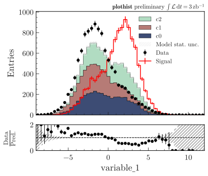
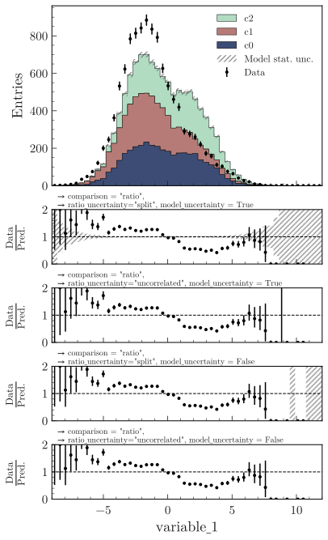

.. _advanced-model_examples-label:

=======================
Plotting model and data
=======================

The examples below make use of a pandas dataframe ``df`` containing dummy data, that can be loaded with:

.. code-block:: python

    from plothist import get_dummy_data
    df = get_dummy_data()

Creating the data and model
===========================

Below is the code that generates the data and model histograms used in all the examples of this section. The idea is to have a ``data_hist`` corresponding to any kind of data representing a count of events over a variable, a ``signal_hist`` corresponding to the signal model, and a list of ``background_hists`` used to model to everything that is not our signal. We also show an example of how to scale the model to the data. We also define three functions that will be used as model components.

.. code-block:: python

    from plothist import make_hist, get_color_palette

    # Define the histograms

    key = "variable_1"
    range = [-9, 12]
    category = "category"

    # Define masks
    signal_mask = df[category] == 7
    data_mask = df[category] == 8

    background_categories = [0, 1, 2]
    background_categories_labels = [f"c{i}" for i in background_categories]
    background_categories_colors = get_color_palette("cubehelix", len(background_categories))

    background_masks = [df[category] == p for p in background_categories]

    # Make histograms
    data_hist = make_hist(df[key][data_mask], bins=50, range=range, weights=1)
    background_hists = [
        make_hist(df[key][mask], bins=50, range=range, weights=1)
        for mask in background_masks
    ]
    signal_hist = make_hist(df[key][signal_mask], bins=50, range=range, weights=1)

    # Optional: scale to data
    background_scaling_factor = data_hist.sum().value / sum(background_hists).sum().value
    background_hists = [background_scaling_factor * h for h in background_hists]

    signal_scaling_factor = data_hist.sum().value / signal_hist.sum().value
    signal_hist *= signal_scaling_factor

    # Define some random functions that will be used as model components with functions
    from scipy.stats import norm

    def f_signal(x):
        return 1000*norm.pdf(x, loc=0.5, scale=3)
    def f_background1(x):
        return 1000*norm.pdf(x, loc=-1.5, scale=4)
    def f_background2(x):
        return 3000*norm.pdf(x, loc=-1.8, scale=1.8)

Simple model plots
==================

If you want to plot only the model, use ``plot_model()``. It supports models made of functions or histograms. Stacked and unstacked components can be combined. The sum will always be the sum of all the components, stacked and unstacked.

It can take a lot more arguments to customize the plot than shown in the examples below, see the documentation for more details.

Histograms
----------

Here is an example with a model made of histograms:

.. literalinclude:: ../examples/model_ex/model_with_stacked_and_unstacked_histograms_components.py
    :language: python
    :start-after: ###

.. image:: ../img/model_with_stacked_and_unstacked_histograms_components.svg
   :alt: Plot of a model with stacked and unstacked histograms components
   :width: 500

Functions
---------

Here is an example with a model made of functions:

.. literalinclude:: ../examples/model_ex/model_with_stacked_and_unstacked_function_components.py
    :language: python
    :start-after: ###

.. image:: ../img/model_with_stacked_and_unstacked_function_components.svg
   :alt: Plot of a model with stacked and unstacked function components
   :width: 500

Compare data and model
======================

A data histogram can be added to the plot with ``plot_data_model_comparison()``. It will then compare the sum of the components to the data, witht the comparison of your choice. The default comparison is the ratio between the model and the data. It can take any comparison method available in ``plot_comparison()``. If the events are unweighted, data uncertainties will always be asymmetrical.

Stacked histograms
------------------

An example with stacked histograms:

.. literalinclude:: ../examples/model_ex/model_examples_stacked.py
    :language: python
    :start-after: ###

Unstacked histograms
--------------------

Unstacked histogram:

.. literalinclude:: ../examples/model_ex/model_examples_unstacked.py
    :language: python
    :start-after: ###

.. image:: ../img/model_examples_unstacked.svg
   :alt: Data/model comparison, stacked plot
   :width: 500

Stacked and unnstacked histograms
---------------------------------

Stacked and unstacked histograms can be combined:

.. literalinclude:: ../examples/model_ex/model_examples_stacked_unstacked.py
    :language: python
    :start-after: ###

.. image:: ../img/model_examples_stacked_unstacked.svg
   :alt: Data/model comparison, stacked and unstacked plot with histograms
   :width: 500

Models made of functions
------------------------

The function ``plot_data_model_comparison()`` can also be used to compare data and functions:

.. literalinclude:: ../examples/model_ex/ratio_data_vs_model_with_stacked_and_unstacked_function_components.py
    :language: python
    :start-after: ###

.. image:: ../img/ratio_data_vs_model_with_stacked_and_unstacked_function_components.svg
   :alt: Data/Model comparison, model with stacked and unstacked function components
   :width: 500

Model uncertainty
-----------------

As said ealier, the comparison function can take any comparison method available in ``plot_comparison()``. To use pulls instead of the ratio to compare the histograms:

.. literalinclude:: ../examples/model_ex/model_examples_pull.py
    :language: python
    :start-after: ###

.. image:: ../img/model_examples_pull.svg
   :alt: Data/model comparison with pull, stacked plot
   :width: 500

Now, if you do not want to show and take into account the model uncertainties, setting ``model_uncertainty`` to ``False`` remove them and updates the definition of the pulls:

.. literalinclude:: ../examples/model_ex/model_examples_pull_no_model_unc.py
    :language: python
    :start-after: ###

.. image:: ../img/model_examples_pull_no_model_unc.svg
   :alt: Data/model comparison with pull, no model stat. unc., stacked plot
   :width: 500

Comparison overview
===================

Here are a series of examples showing complex plots resuming all the possible comparisons between data and model. The idea is to show how to use ``plot_comparison()`` and ``plot_data_model_comparison()`` to make the plots shown in the examples below. The plots are a bit more complex than the ones shown above, but the code to produce them is still quite simple.

All the different comparisons
-----------------------------

Below is shown how to make a plot with all the possible comparisons between data and model. The idea is to use ``plot_data_model_comparison()`` to make the plot with the ratio comparison, and then use ``plot_comparison()`` to add the other comparisons. The ``plot_comparison()`` function can take a ``fig`` and ``ax`` argument to add the comparison to an existing figure. The ``plot_data_model_comparison()`` function returns the figure and axes used to make the plot, so we can use them to add the other comparisons.

.. literalinclude:: ../examples/model_ex/model_all_comparisons.py
    :language: python
    :start-after: ###

.. image:: ../img/model_all_comparisons.svg
   :alt: Data/model comparison with all comparisons, stacked plot
   :width: 500

No model uncertainties
----------------------

Same example plot but we remove the statistical uncertainties of the model by adding ``model_uncertainty=False`` in ``plot_data_model_comparison()`` and pass a model histogram without uncertainties to ``plot_comparison()``:

.. literalinclude:: ../examples/model_ex/model_all_comparisons_no_model_unc.py
    :language: python
    :start-after: ###

.. image:: ../img/model_all_comparisons_no_model_unc.svg
   :alt: Data/model comparison with all comparisons, no model uncertainties, stacked plot
   :width: 500

Ratio options
-------------

For ``ratio`` or ``relative_difference``, the uncertainties can be split between model and data (default option) or both can be added to the ratio uncertainty (``ratio_uncertainty_type="uncorrelated"``). Here are all the possible options:

.. literalinclude:: ../examples/model_ex/model_comparisons_ratio_options.py
    :language: python
    :start-after: ###

