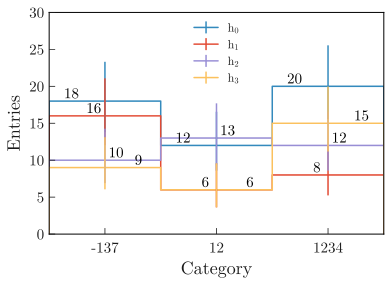

.. _advanced-label:

=======================
Other advanced examples
=======================

This section shows how to use the ``plothist`` package to make more complex plots. The examples below take advantage of the flexibility of the package to produce more advanced plots with ease. For each example, the code is commented to explain the logic and steps taken to produce the plots.

The examples use of a numpy ndarray ``df`` containing dummy data (you may also use a pandas dataframe), that can be loaded with:

.. code-block:: python

    from plothist_utils import get_dummy_data

    df = get_dummy_data()

Advanced example comparing two histograms
=========================================

In this example, we will compare two tuples of histograms and use pull and ratio comparisons. First, we make the histograms and scale them. Then, we plot the histograms and the comparison plots on different axes:

.. image:: ../img/1d_comparison_advanced.svg
   :alt: Advanced hist comparison
   :width: 500

.. literalinclude:: ../examples/advanced/1d_comparison_advanced.py
   :language: python
   :start-after: ###

.. _advanced-asymmetry-label:
Advanced example using asymmetry comparison
===========================================

This example shows how to plot an asymmetry plot between two histograms and two functions. Information on how to convert a function from an external fitting package to an object that can be used by ``plothist`` can be found in :ref:`plot-fit-result-label`.

.. image:: ../img/asymmetry_comparison_advanced.svg
   :alt: Advanced asymmetry comparison
   :width: 500

.. literalinclude:: ../examples/advanced/asymmetry_comparison_advanced.py
   :language: python
   :start-after: ###

Flatten 2D variable
===================

Compare data and stacked histogram for a flatten 2D variable:

.. image:: ../img/model_examples_flatten2D.svg
   :alt: Data/model comparison, flatten variable
   :width: 500

.. literalinclude:: ../examples/advanced/model_examples_flatten2D.py
    :language: python
    :start-after: ###

Multiple histograms, side by side, with numbers on top
======================================================

This example shows how to plot multiple 1D histograms side by side, with numbers on top of each bars. The code is similar to the one used in the :ref:`basics-1d_hist_side_by_side-label` section.

.. literalinclude:: ../examples/advanced/1d_side_by_side_with_numbers.py
   :language: python
   :start-after: ###
