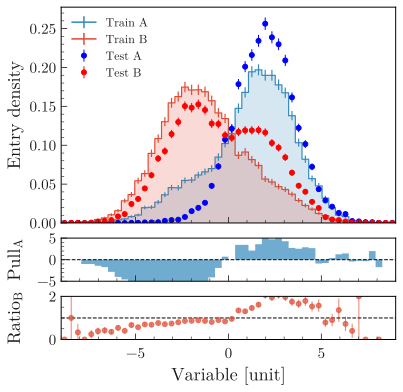

.. _advanced-label:

====================
Other advanced plots
====================

The examples below make use of a pandas dataframe ``df`` containing dummy data, that can be generated with:

.. code-block:: python

    from plothist.generate_dummy_data import generate_dummy_data
    df = generate_dummy_data()

Advanced 1D
===========

Compare two histograms
----------------------

In this example, we will compare two tuples of histograms and use pull and ratio comparisons.

First, we make the histograms and scale them. Then, we plot the histograms and the comparison plots on different axes:

.. literalinclude:: ../examples/advanced/1d_comparison_advanced.py
   :language: python
   :start-after: ###

Flatten 2D variable
-------------------

Compare data and stacked histogram for a flatten 2D variable:

.. literalinclude:: ../examples/model_ex/model_examples_flatten2D.py
    :language: python
    :start-after: ###

.. image:: ../img/model_examples_flatten2D.svg
   :alt: Data/model comparison, flatten variable
   :width: 500

Advanced 2D
===========

Display 1D distributions
------------------------

To plot a 2d histogram with x and y projections:

.. literalinclude:: ../examples/advanced/2d_hist_with_projections.py
    :language: python
    :start-after: ###

.. image:: ../img/2d_hist_with_projections.svg
   :alt: 2d hist with x and y projections
   :width: 500
