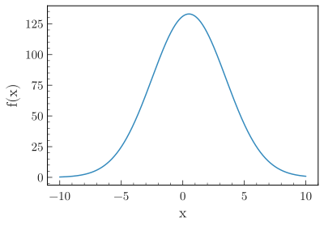

.. _basics-1d_func-label:

==============
Plot functions
==============

The examples below make use of a numpy ndarray ``df`` containing dummy data (you may also use a pandas dataframe), that can be loaded with:

.. code-block:: python

    from plothist import get_dummy_data

    df = get_dummy_data()

.. note::
   This page presents functions of ``plothist`` step by step and gives information about how to use them.
   To reproduce the examples, please visit the `example gallery <https://plothist.readthedocs.io/en/latest/example_gallery/>`_, because it contains a standalone script for each example, that you can run directly.

.. note::
    All the functions used in the examples below can take a lot more arguments to customize the plot, see the :ref:`documentation-label` for more details.

Simple function
===============

Plothist supports plotting of functions using the :func:`plot_function() <plothist.plotters.plot_function>` function:

.. literalinclude:: ../examples/1d_func/1d_fct.py
    :language: python
    :start-after: ###

In particular, you can stack functions:

.. literalinclude:: ../examples/1d_func/1d_fct_stacked.py
    :language: python
    :start-after: ###

.. image:: ../img/1d_fct_stacked.svg
    :alt: Simple stacked function
    :width: 500

Comparison with functions
=========================

To compare one histogram with a model made of one or multiple functions, see :ref:`advanced-model-functions-comparison-label`.

To compare two functions together, see :ref:`advanced-asymmetry-label`.

Utilities
=========

Example on how to convert a function from an external fitting package to an object that can be used by ``plothist`` can be found in :ref:`plot-fit-result-label`.
