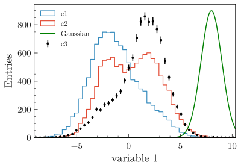
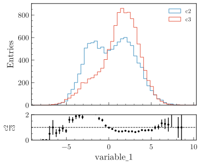

.. _basics-1d_hist-label:

=================
Basic 1D examples
=================

The examples below make use of a pandas dataframe ``df`` containing dummy data, that can be generated with:

.. code-block:: python

    from plothist.generate_dummy_data import generate_dummy_data
    df = generate_dummy_data()

Example scripts are available in the repository in the ``examples/`` folder.

Simple plot
===========

To plot a simple 1d histogram:

.. code-block:: python

    from plothist import make_hist, plot_hist
    import matplotlib.pyplot as plt

    name = "variable_0"

    fig, ax = plt.subplots()

    h = make_hist(df[name])

    plot_hist(h, ax=ax)

    ax.set_xlabel(name)
    ax.set_ylabel("Entries")

    fig.savefig("1d_hist_simple.svg", bbox_inches='tight')

.. image:: ../img/1d_hist_simple.svg
   :alt: Simple hist
   :width: 500

With variable manager
=====================

If you have multiple variable to plot, use the variable manager:

.. code-block:: python

    from plothist import create_variable_registry

    variable_keys = ["variable_0", "variable_1", "variable_2"]

    create_variable_registry(variable_keys)

It will automatically create a ``yaml`` file with all the plotting information for each variable:

.. code-block:: yaml

    variable_0:
    name: variable_0
    bins: 50
    range:
    - min
    - max
    label: variable_0
    log: false
    legend_location: best
    legend_ncols: 1
    docstring: ''

    variable_1:
        ...

It is then really easy to modify the plotting information. Also really convenient to plot the same variable with different plotting parameters, as a variable is identified by its ``variable_key``.

Then, just get the variable from the registery to make every plots:

.. code-block:: python

    from plothist import make_hist, plot_hist
    from plothist import update_variable_registry_ranges, get_variable_from_registry
    import matplotlib.pyplot as plt

    # If no range specified for some variable_keys, update the yaml with actual min and max value
    update_variable_registry_ranges(df, variable_keys)

    for variable_key in variable_keys:
        variable = get_variable_from_registry(variable_key)

        fig, ax = plt.subplots()
        h = make_hist(
            df[variable["name"]], bins=variable["bins"], range=variable["range"]
        )
        plot_hist(h, ax=ax)
        ax.set_xlabel(variable["label"])

        ax.set_xlim(variable["range"])
        ax.set_ylabel("Entries")

As we can see in the example, ``get_variable_from_registry(variable_key)`` is used to get access the parameters of the variable.

Also, you can easily get the ``[min, max]`` range values using ``update_variable_registry_ranges(data, [variable_key])``. The yaml will automatically update. Then, you can modify the yaml to get a more suitable range to display in the plot.

Adding simple elements
======================

It is really easy to add multiple histogram to the same figure:

.. code-block:: python

    from plothist import make_hist, plot_hist
    import matplotlib.pyplot as plt

    name = "variable_1"
    category = "category"

    x1 = df[name][df[category] == 1]
    x2 = df[name][df[category] == 2]

    x_range = (min(min(x1), min(x2)), max(max(x1), max(x2)))

    h1 = make_hist(x1, bins=50, range=x_range)
    h2 = make_hist(x2, bins=50, range=x_range)

    fig, ax = plt.subplots()

    plot_hist(h1, ax=ax, histtype="step", linewidth=1.2, label="c1")
    plot_hist(h2, ax=ax, histtype="step", linewidth=1.2, label="c2")

    ax.set_xlabel(name)
    ax.set_ylabel("Entries")
    ax.set_xlim(x_range)
    ax.legend()

    fig.savefig("1d_elt1.svg", bbox_inches='tight')

.. image:: ../img/1d_elt1.svg
   :alt: Simple hist
   :width: 500

To this, we can add an error-point histogram:

.. code-block:: python

    from plothist import plot_error_hist

    x3 = df[name][df[category] == 3]

    h3 = make_hist(x3, bins=50, range=x_range)

    plot_error_hist(h3, ax=ax, color="black", label="c3")

    # Update the legend
    ax.legend()

    fig.savefig("1d_elt2.svg", bbox_inches='tight')

.. image:: ../img/1d_elt2.svg
   :alt: Simple hist
   :width: 500

We can also add functions using ``scipy``:

.. code-block:: python

    import numpy as np
    from scipy.stats import norm

    x = np.linspace(x_range[0], x_range[1], 200)

    # Define the gaussian function of mean=8 and std_dev=1
    y = norm.pdf(x, 8, 1)

    # Normalize the function
    y *= 900 / max(y)

    ax.plot(x, y, color='green', label='Gaussian')

    # Update the legend
    ax.legend()

    fig.savefig("1d_elt3.svg", bbox_inches='tight')

Comparing two histograms
========================

To compare two histograms, using the histograms defined above:

.. code-block:: python

    from plothist import compare_two_hist

    fig, ax_main, ax_comparison = compare_two_hist(
        h2,
        h3,
        xlabel=name,
        ylabel="Entries",
        x1_label="c2",
        x2_label="c3",
        save_as="1d_comparison.svg",
    )

