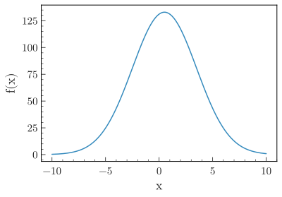
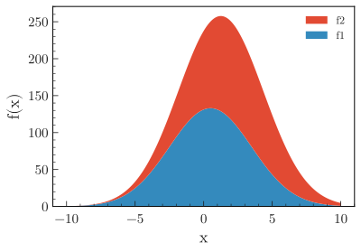

.. _basics-1d_hist-label:

==================
Plot 1D histograms
==================

The examples below make use of a numpy ndarray ``df`` containing dummy data (you may also use a pandas dataframe), that can be loaded with:

.. code-block:: python

    from plothist import get_dummy_data

    df = get_dummy_data()

.. note::
   This page presents functions of ``plothist`` step by step and gives information about how to use them.
   To reproduce the examples, please visit the `plot gallery <https://plothist.readthedocs.io/en/latest/example_gallery/>`_, because it contains a standalone script for each example, that you can run directly.

.. note::
    All the functions used in the examples below can take a lot more arguments to customize the plot, see the :ref:`documentation-label` for more details.

Simple 1D histogram
===================

To plot a simple 1d histogram:

.. literalinclude:: ../examples/1d_hist/1d_hist_simple.py
    :language: python
    :start-after: ###

.. image:: ../img/1d_hist_simple.svg
   :alt: Simple hist
   :width: 500

It is really easy to add multiple histogram to the same figure:

.. literalinclude:: ../examples/1d_hist/1d_elt1.py
    :language: python
    :start-after: ###

.. image:: ../img/1d_elt1.svg
   :alt: Simple hist
   :width: 500

or stack them:

.. literalinclude:: ../examples/1d_hist/1d_elt1_stacked.py
    :language: python
    :start-after: ###

.. image:: ../img/1d_elt1_stacked.svg
   :alt: Simple stacked hist
   :width: 500

.. note::
    The function :func:`make_hist() <plothist.histogramming.make_hist>` returns a `boost_histogram.Histogram <https://boost-histogram.readthedocs.io/en/latest/>`_ object that supports potentially weighted data. You may call the :func:`make_hist() <plothist.histogramming.make_hist>` function without input data and fill the histogram object later in your code. An advantage of separating the histogramming from the plotting is that you can plot large datasets without having to load all the data into memory (see `this tutorial <https://github.com/cyrraz/visualise-large-dataset>`_).

.. warning::
    Note that in ``boost_histogram``, the upper edges of the bins are exclusive.

Histogram with error bars
=========================

To perform a simple histogram with error bars, use the :func:`plot_error_hist() <plothist.plotters.plot_error_hist>` function:

.. literalinclude:: ../examples/1d_hist/1d_elt2.py
    :language: python
    :start-after: ###

.. image:: ../img/1d_elt2.svg
   :alt: Simple error hist
   :width: 500

The function can also take what kind of bin uncertainty to use for hist with the argument ``uncertainty_type``: ``"symmetrical"`` for the Poisson standard deviation derived from the variance stored in the histogram object, ``"asymmetrical"`` for asymmetrical uncertainties based on a Poisson confidence interval. Default is ``"symmetrical"``.

Plotting functions
==================

Everything presented for the histogram is also true to plot functions using the :func:`plot_function() <plothist.plotters.plot_function>` function:

.. literalinclude:: ../examples/1d_hist/1d_fct.py
    :language: python
    :start-after: ###

In particular, you can stack functions:

.. literalinclude:: ../examples/1d_hist/1d_fct_stacked.py
    :language: python
    :start-after: ###

.. _basics-1d_hist_comparison-label:
Comparing two histograms
========================

To compare two histograms, five comparison methods are available: ``ratio``, ``pull``, ``difference``, ``relative_difference`` and ``asymmetry``. The examples below are using the histograms defined above.

Ratio
-----

Ratio is the default comparison method:

.. literalinclude:: ../examples/1d_hist/1d_comparison_ratio.py
    :language: python
    :start-after: ###

.. image:: ../img/1d_comparison_ratio.svg
   :alt: Simple ratio comparison
   :width: 500

Pull
----

To perform a pull comparison:

.. literalinclude:: ../examples/1d_hist/1d_comparison_pull.py
    :language: python
    :start-after: ###

.. image:: ../img/1d_comparison_pull.svg
   :alt: Simple pull comparison
   :width: 500

Difference
----------

To plot the difference between the two histograms:

.. literalinclude:: ../examples/1d_hist/1d_comparison_difference.py
    :language: python
    :start-after: ###

.. image:: ../img/1d_comparison_difference.svg
   :alt: Simple difference comparison
   :width: 500

Relative difference
-------------------

To plot the relative difference between the two histograms:

.. literalinclude:: ../examples/1d_hist/1d_comparison_relative_difference.py
    :language: python
    :start-after: ###

.. image:: ../img/1d_comparison_relative_difference.svg
   :alt: Simple difference comparison
   :width: 500

Asymmetry
---------

To plot the asymmetry between the two histograms:

.. literalinclude:: ../examples/1d_hist/1d_comparison_asymmetry.py
    :language: python
    :start-after: ###

.. image:: ../img/1d_comparison_asymmetry.svg
   :alt: Simple asymmetry comparison
   :width: 500

Efficiency
----------

To plot the ratio between two histograms h1 and h2 when the entries of h1 are a subset of the entries of h2. The variances are calculated according to the formula given in :ref:`documentation-statistics-label`:

.. literalinclude:: ../examples/1d_hist/1d_comparison_efficiency.py
    :language: python
    :start-after: ###

.. image:: ../img/1d_comparison_efficiency.svg
   :alt: Simple efficiency comparison
   :width: 500

Comparison with functions
=========================

To compare one histogram with one or multiple functions, see :ref:`advanced-model-functions-comparison-label`.

To compare two functions together, see :ref:`advanced-asymmetry-label`.

To only plot the comparison
===========================

With any of the examples above, you can use the :func:`plot_comparison() <plothist.plotters.plot_comparison>` function to only plot the comparison. Here is an example with the efficiency comparison of two histograms:

.. literalinclude:: ../examples/1d_hist/1d_comparison_only_efficiency.py
    :language: python
    :start-after: ###

.. image:: ../img/1d_comparison_only_efficiency.svg
    :alt: Simple efficiency comparison, only the comparison
    :width: 500

Get the values of the comparison
================================

To easily get the values and the uncertainties of the comparison, the :func:`get_comparison() <plothist.comparison.get_comparison>`  function returns three arrays: the values, the lower uncertainties and the upper uncertainties. Here is an example with the ratio comparison:

.. code-block:: python

    from plothist.comparison import get_comparison

    values, lower_uncertainties, upper_uncertainties = get_comparison(
        h1, h2, comparison="ratio"
    )
