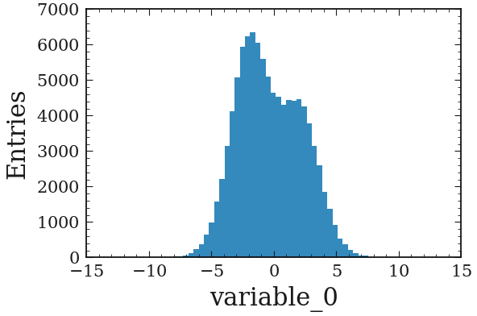

.. _basics-1d_hist-label:

=================
Basic 1D examples
=================

Simple plot
===========

To plot a simple 1d histogram:

.. code-block:: python

    from plothist.plotters import make_hist, plot_hist
    import matplotlib.pyplot as plt

    name = "variable_0"

    fig, ax = plt.subplots()

    h = make_hist(df[name])

    plot_hist(h, ax=ax)

    ax.set_xlabel(name)
    ax.set_ylabel("Entries")

    plt.show()

With variable manager
=====================

If you have multiple variable to plot, use the variable manager:

.. code-block:: python

    from plothist.plotters import create_variable_registry

    variable_keys = ["variable_0", "variable_1", "variable_2"]

    create_variable_registry(variable_keys)

It will automatically create a ``yaml`` file with all the plotting information for each variable:

.. code-block:: yaml

    variable_0:
    name: variable_0
    bins: 50
    range:
    - min
    - max
    label: variable_0
    log: false
    legend_location: best
    legend_ncols: 1
    docstring: ''

    variable_1:
        ...

It is then really easy to modify the plotting information. Also really convenient to plot the same variable with different plotting parameters, as a variable is identified by its ``variable_key``.

Then, just get the variable from the registery to make every plots:

.. code-block:: python

    from plothist.plotters import make_hist, plot_hist
    from plothist.plotters import update_variable_registry_ranges, get_variable_from_registry

    # If no range specified for some variable_keys, update the yaml with actual min and max value
    update_variable_registry_ranges(df, variable_keys)

    for variable_key in variable_keys:
        variable = get_variable_from_registry(variable_key)

        fig, ax = plt.subplots()
        h = make_hist(
            df[variable["name"]], bins=variable["bins"], range=variable["range"]
        )
        plot_hist(h, ax=ax)
        ax.set_xlabel(variable["label"])

        ax.set_xlim(variable["range"])
        ax.set_ylabel("Entries")

As we can see in the example, ``get_variable_from_registry(variable_key)`` is used to get access the parameters of the variable.

Also, you can easily get the ``[min, max]`` range values using ``update_variable_registry_ranges(data, [variable_key])``. The yaml will automatically update. Then, you can modify the yaml to get a more suitable range to diplay in the plot.

