.. _basics-1d_hist-label:

==================
Plot 1D histograms
==================

The examples below make use of a numpy ndarray ``df`` containing dummy data (you may also use a pandas dataframe), that can be loaded with:

.. code-block:: python

    from plothist import get_dummy_data

    df = get_dummy_data()

.. note::
   This page presents functions of ``plothist`` step by step and gives information about how to use them.
   To reproduce the examples, please visit the `example gallery <https://plothist.readthedocs.io/en/latest/example_gallery/>`_, because it contains a standalone script for each example, that you can run directly.

.. note::
    All the functions used in the examples below can take a lot more arguments to customize the plot, see the :ref:`documentation-label` for more details.

Simple 1D histogram
===================

To plot a simple 1D histogram, you first need to create a histogram object with the :func:`make_hist() <plothist.histogramming.make_hist>` function that you can then plot with the :func:`plot_hist() <plothist.plotters.plot_hist>` function:

.. literalinclude:: ../examples/1d_hist/1d_hist_simple.py
    :language: python
    :start-after: ###

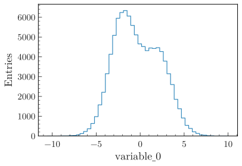

.. note::
    The function :func:`make_hist() <plothist.histogramming.make_hist>` returns a `boost_histogram.Histogram <https://boost-histogram.readthedocs.io/en/latest/>`_ object that supports potentially weighted data. You may call the :func:`make_hist() <plothist.histogramming.make_hist>` function without input data and fill the histogram object later in your code. An advantage of separating the histogramming from the plotting is that you can plot large datasets without having to load all the data into memory (see `this tutorial <https://github.com/cyrraz/visualise-large-dataset>`_).

To add multiple histograms to the same plot, you can just call the :func:`make_hist() <plothist.histogramming.make_hist>` and :func:`plot_hist() <plothist.plotters.plot_hist>` functions multiple times:

.. literalinclude:: ../examples/1d_hist/1d_elt1.py
    :language: python
    :start-after: ###

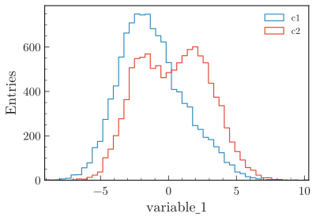

To stack them, use the argument ``stacked=True`` in the :func:`plot_hist() <plothist.plotters.plot_hist>` function:

.. literalinclude:: ../examples/1d_hist/1d_elt1_stacked.py
    :language: python
    :start-after: ###

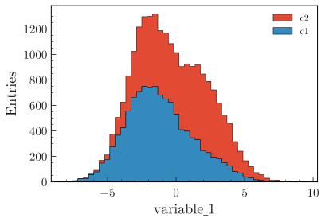

Histogram with error bars
=========================

To plot a simple histogram with error bars, use the :func:`plot_error_hist() <plothist.plotters.plot_error_hist>` function. The default error bars are the Poisson standard deviation derived from the variance stored in the histogram object.

.. literalinclude:: ../examples/1d_hist/1d_elt2.py
    :language: python
    :start-after: ###

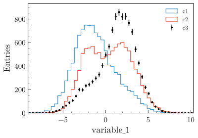

You can also display the error as an asymmetrical uncertainties based on a Poisson confidence interval with the argument ``uncertainty_type="asymmetrical"``.

.. note::
    Asymmetrical uncertainties can only be computed for unweighted histograms, because the bin contents of a weighted histogram do not follow a Poisson distribution. More information in :ref:`documentation-statistics-label`.

.. _basics-1d_hist_comparison-label:
Comparing two histograms
========================

To compare two histograms, you can use the :func:`plot_two_hist_comparison() <plothist.plotters.plot_two_hist_comparison>` function. The function takes two histograms as input and compares them using one of the seven comparison methods available: ``ratio``, ``split_ratio``, ``pull``, ``difference``, ``relative_difference``, ``asymmetry`` and ``efficiency``. The examples below are using the histograms defined above.

Ratio
-----

Ratio is the default comparison method:

.. literalinclude:: ../examples/1d_hist/1d_comparison_ratio.py
    :language: python
    :start-after: ###

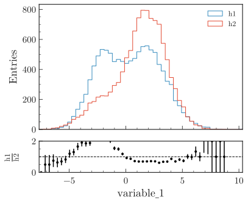

Split ratio
-----------

When the ``split_ratio`` option is used, both the h1 and h2 uncertainties are scaled down by the h2 bin contents. The h2 adjusted uncertainties are shown separately as a hatched area. In practice, the ``split_ratio`` comparison option is used when h1 is filled with measured data and h2 is a model, see :ref:`advanced-model_comparison-label` section for more details.

.. literalinclude:: ../examples/1d_hist/1d_comparison_split_ratio.py
    :language: python
    :start-after: ###

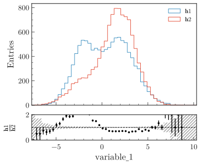

Pull
----

To perform a pull comparison between two histograms:

.. literalinclude:: ../examples/1d_hist/1d_comparison_pull.py
    :language: python
    :start-after: ###

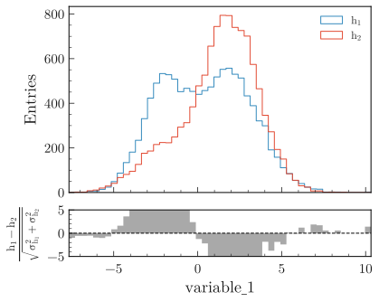

Difference
----------

To plot the difference between two histograms:

.. literalinclude:: ../examples/1d_hist/1d_comparison_difference.py
    :language: python
    :start-after: ###

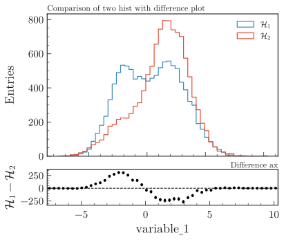

Relative difference
-------------------

To plot the relative difference between two histograms:

.. literalinclude:: ../examples/1d_hist/1d_comparison_relative_difference.py
    :language: python
    :start-after: ###

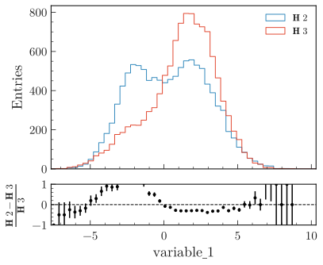

Asymmetry
---------

To plot the asymmetry between two histograms:

.. literalinclude:: ../examples/1d_hist/1d_comparison_asymmetry.py
    :language: python
    :start-after: ###

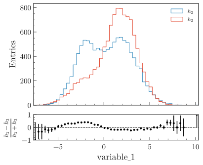

Efficiency
----------

This example shows how to plot the ratio between two histograms h1 and h2 when the entries of h1 are a subset of the entries of h2. The variances are calculated according to the formula given in :ref:`documentation-statistics-label`.

.. literalinclude:: ../examples/1d_hist/1d_comparison_efficiency.py
    :language: python
    :start-after: ###

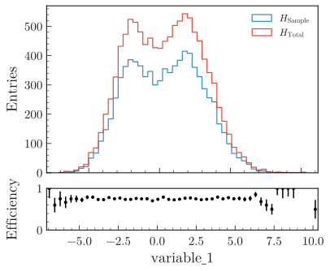

To only plot the comparison
===========================

With any of the comparison shown above, you can use the :func:`plot_comparison() <plothist.plotters.plot_comparison>` function to only plot the comparison. Here is an example with the efficiency comparison of two histograms:

.. literalinclude:: ../examples/1d_hist/1d_comparison_only_efficiency.py
    :language: python
    :start-after: ###

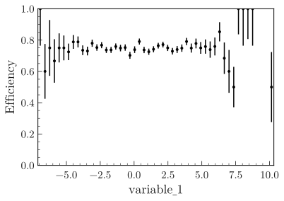

Get the values of the comparison
================================

To easily get the values and the uncertainties of the comparison, the :func:`get_comparison() <plothist.comparison.get_comparison>`  function returns three arrays: the values, the lower uncertainties and the upper uncertainties. Here is an example with the ratio comparison:

.. code-block:: python

    from plothist import get_comparison

    values, lower_uncertainties, upper_uncertainties = get_comparison(
        h1, h2, comparison="ratio"
    )

Mean histogram (profile plot)
=============================

The function :func:`make_hist() <plothist.histogramming.make_hist>` returns a counting histogram (technically, a `boost_histogram.Histogram <https://boost-histogram.readthedocs.io/en/latest/user-guide/histogram.html>`_ of ``COUNT`` kind), where each bin holds the total number of data points or their weighted sum.
The ``boost_histogram`` package also supports mean histograms, where each bin holds the (possibly weighted) average of a sample.

The example below shows how to create a mean histogram (also called a profile) in ``boost_histogram`` and plot it with ``plothist``.
In this example, the data points and the error bars are the average value and the standard deviation of the sample in each bin, respectively.

Note that most functions in ``plothist`` work only with counting histograms and will raise an error if you try to use them with a mean histogram.

.. literalinclude:: ../examples/1d_hist/1d_profile.py
    :language: python
    :start-after: ###

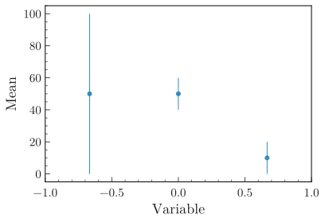

Histogram with category axis
============================

The function :func:`make_hist() <plothist.histogramming.make_hist>` returns a a `boost_histogram.Histogram <https://boost-histogram.readthedocs.io/en/latest/user-guide/histogram.html>`_ with a regular or a variable axis, but the ``boost_histogram`` package also supports categorical axes.

The examples below show how to create a histogram with a category axis in ``boost_histogram`` and plot it with ``plothist``.

Integer category
----------------

.. literalinclude:: ../examples/1d_hist/1d_int_category.py
    :language: python
    :start-after: ###

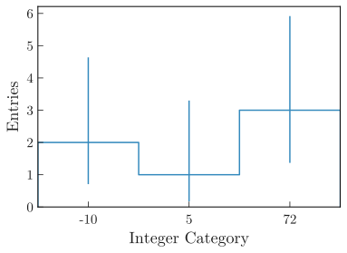

.. note::
    When we create the histograms in this example, we use the argument ``storage=bh.storage.Weight()``.
    This is because the functions in ``plothist`` assume histograms with a storage that supports weighted data, where the variance of each bin is tracked (more details `here <https://boost-histogram.readthedocs.io/en/latest/user-guide/storage.html#weight>`_ and `there <https://boost-histogram.readthedocs.io/en/latest/api/boost_histogram.html#boost_histogram._internal.hist.Histogram.variances>`_).
    When creating histograms with regular or variable axes with the function :func:`make_hist() <plothist.histogramming.make_hist>`, as in most of the previous examples, the storage is automatically set to ``bh.storage.Weight()``, so the user does not have to worry about it.

String category
---------------

.. literalinclude:: ../examples/1d_hist/1d_str_category.py
    :language: python
    :start-after: ###

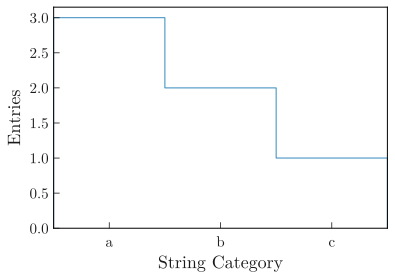

.. _basics-1d_hist_side_by_side-label:
Using multiple histograms
-------------------------

With multiple histograms, the :func:`plot_hist() <plothist.plotters.plot_hist>` function will correctly put them side by side:

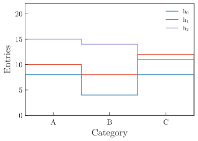

.. literalinclude:: ../examples/1d_hist/1d_side_by_side.py
    :language: python
    :start-after: ###
