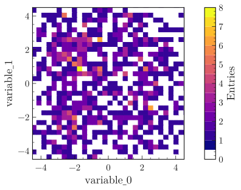
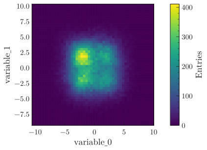
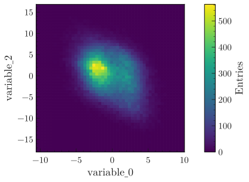
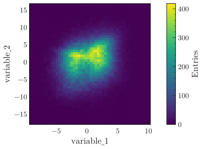

.. _basics-2d_hist-label:

==================
Plot 2D histograms
==================

The examples below make use of a numpy ndarray ``df`` containing dummy data (you may also use a pandas dataframe), that can be loaded with:

.. code-block:: python

    from plothist import get_dummy_data

    df = get_dummy_data()

.. note::
   This page presents functions of ``plothist`` step by step and gives information about how to use them.
   To reproduce the examples, please visit the `example gallery <https://plothist.readthedocs.io/en/latest/example_gallery/>`_, because it contains a standalone script for each example, that you can run directly.

Simple plot
===========

Plotting a simple 2D histogram is very similar to plotting a 1D histogram. The function :func:`make_2d_hist() <plothist.histogramming.make_2d_hist>` is used to create the 2D histogram, and the function :func:`plot_2d_hist() <plothist.plotters.plot_2d_hist>` is used to plot it.

.. literalinclude:: ../examples/2d_hist/2d_hist_simple.py
    :language: python
    :start-after: ###

.. image:: ../img/2d_hist_simple.svg
   :alt: Simple 2d hist
   :width: 500

Change the colormap
-------------------

The argument ``cmap`` in ``pcolormesh_kwargs`` can be used to change the colormap. Any matplotlib colormap can be used (see :ref:`usage-style-label`). By default, ``pcolormesh_kwargs = {'cmap': 'viridis'}``.

Here is a more complex example on how to get a discrete colormap:

.. literalinclude:: ../examples/2d_hist/2d_hist_simple_discrete_colormap.py
    :language: python
    :start-after: ###

.. _basics-2d_hist-correlation-label:
Correlations with variable registry
===================================

The variable registry is a really useful tool to manage and plot the correlation between multiple variables (see :ref:`basics-variable_registry-label` on how to use it.)

.. literalinclude:: ../examples/2d_hist/2d_hist_correlations.py
    :language: python
    :start-after: ###

|img1| |img2| |img3|

Uneven binning
==============

Instead of inputing a number of bins and a range in :func:`make_2d_hist() <plothist.histogramming.make_2d_hist>`, the bins parameter can be a list of all the edges:

.. literalinclude:: ../examples/2d_hist/2d_hist_uneven.py
    :language: python
    :start-after: ###

.. image:: ../img/2d_hist_uneven.svg
   :alt: 2d hist with uneven binning
   :width: 500

Display 1D distributions
========================

To plot a 2d histogram with x and y projections, the function :func:`plot_2d_hist_with_projections() <plothist.plotters.plot_2d_hist_with_projections>` can be used. The corresponding projections are displayed on the top and right of the 2D histogram, and the colorbar is clearly displayed and labeled.

.. literalinclude:: ../examples/2d_hist/2d_hist_with_projections.py
    :language: python
    :start-after: ###

.. image:: ../img/2d_hist_with_projections.svg
   :alt: 2d hist with x and y projections
   :width: 500
