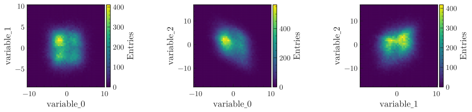

.. _basics-2d_hist-label:

========
Basic 2D
========

The examples below make use of a pandas dataframe ``df`` containing dummy data, that can be generated with:

.. code-block:: python

    from plothist.generate_dummy_data import generate_dummy_data
    df = generate_dummy_data()

Simple plot
===========

To plot a simple 1d histogram:

.. code-block:: python

    from plothist import make_2d_hist, plot_2d_hist
    import matplotlib.pyplot as plt

    name_x = "variable_0"
    name_y = "variable_1"

    fig, ax = plt.subplots(figsize=(4,4))

    h = make_2d_hist([df[name_x], df[name_y]])

    plot_2d_hist(h, ax=ax, colorbar_kwargs={"label": "Entries"})

    ax.set_xlabel(name_x)
    ax.set_ylabel(name_y)

    ax.set_xlim(-9, 9)
    ax.set_ylim(-9, 9)

    fig.savefig("2d_hist_simple.svg", bbox_inches='tight')

.. image:: ../img/2d_hist_simple.svg
   :alt: Simple 2d hist
   :width: 500

Correlations with variable manager
==================================

Same as for 1D histogram, variable manager can be practical to manage and see the correlation between multiple variables:

.. code-block:: python

    from itertools import combinations
    from plothist import make_2d_hist, plot_2d_hist
    from plothist import create_variable_registry, update_variable_registry_ranges, get_variable_from_registry
    import matplotlib.pyplot as plt

    # No need to redo this step if the registry was already created before
    variable_keys = ["variable_0", "variable_1", "variable_2"]
    create_variable_registry(variable_keys)
    update_variable_registry_ranges(df, variable_keys)

    fig, axs = plt.subplots(nrows=1, ncols=3, figsize=(15, 3))
    plt.subplots_adjust(wspace=1)

    # Get all the correlation plot between the variables
    variable_keys_combinations = list(combinations(variable_keys, 2))
    for variable_keys_combination, ax in zip(variable_keys_combinations, axs):
        variable0 = get_variable_from_registry(variable_keys_combination[0])
        variable1 = get_variable_from_registry(variable_keys_combination[1])

        h = make_2d_hist(
            [df[variable0["name"]], df[variable1["name"]]],
            bins=(variable0["bins"], variable1["bins"]),
            range=(variable0["range"], variable1["range"]),
        )

        plot_2d_hist(h, ax=ax, colorbar_kwargs={"label": "Entries"})

        ax.set_xlabel(variable0["name"])
        ax.set_ylabel(variable1["name"])

        ax.set_xlim(variable0["range"])
        ax.set_ylim(variable1["range"])

    fig.savefig("2d_hist_correlations.svg", bbox_inches='tight')

Advanced
========

Uneven binning
------------

Instead of inputing a number of bins and a range in ``make_2d_hist()``, the bins parameter can be a list of all the edges:

.. code-block:: python

    import matplotlib.pyplot as plt
    from plothist import make_2d_hist, plot_2d_hist

    name_x = "variable_0"
    name_y = "variable_1"
    # Bins [-10,0], [0,10] for variable 1,
    # and bins [-10,-5], [-5,0], [0,5], [5,10] for variable 2
    bins = [[-10, 0, 10], [-10, -5, 0, 5, 10]]

    fig, ax = plt.subplots(figsize=(4,4))

    h = make_2d_hist([df[name_x], df[name_y]], bins=bins)

    plot_2d_hist(h, ax=ax, colorbar_kwargs={"label": "Entries"})

    ax.set_xlabel(name_x)
    ax.set_ylabel(name_y)

    fig.savefig("2d_hist_uneven.svg", bbox_inches='tight')

.. image:: ../img/2d_hist_uneven.svg
   :alt: 2d hist with uneven binning
   :width: 500

Display 1D distributions
------------------------

In development.