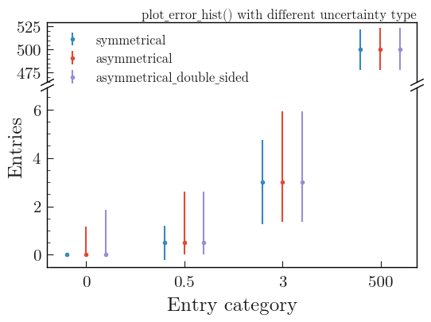

.. _documentation-statistics-label:

===================
Notes on statistics
===================

In the :func:`plot_error_hist() <plothist.plotters.plot_error_hist>` function, the represented uncertainties can be:

- ``symmetrical``: use the square root of the variance of the histogram
- ``asymmetrical``: frequentist approach based on a Poisson confidence interval (see `page 16 on this presentation <https://www.nikhef.nl/~ivov/Statistics/PoissonError/2017_05_15_PoissonError_LHCb_IvovanVulpen.pdf>`_)

    - the upper limit on bins with no entries can be interpreted differently. By default, a one-sided 68% confidence bound is used. The behavior can be changed using the ``uncertainty_type = asymmetrical_double_sided_zeros``, which will use a two-sided 68% confidence bound.
    - this method doesn't support weighted histograms. For more details, see the `note about uncertainties when the histogram entries are weighted <https://www.pp.rhul.ac.uk/~cowan/stat/notes/errors_with_weights.pdf>`_.

The uncertainty on the efficiency (ratio of two histograms h1 and h2 when the entries of h1 are a subset of the entries of h2) in :func:`get_efficiency() <plothist.comparison.get_efficiency>` is calculated following equation (19) of:

- `T. Ullrich, Z. Xu, Treatment of Errors in Efficiency Calculations, arxiv: 0701199v1. <https://arxiv.org/pdf/physics/0701199v1.pdf>`_
