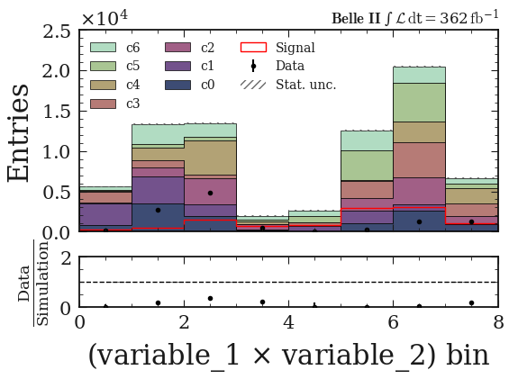

PlotHist
========

**Plot histograms in a scalable way and a beautiful style.**

.. image:: img/hist_hep_example.png
   :alt: hep example
   :width: 320
   :align: center

Main idea
---------

Major advantages: scalability, style and user friendly way of managing variables.

Idea: separate the histogram creation from its data. Then you can easily manage histogram objects (`boostHist` library) and plot large amount of variables and data really fast.

.. code-block:: python
    key = "variable_0"

    fig, ax = plt.subplots()

    h = make_hist(df[key])

    plot_hist(h, ax=ax)

    ax.set_xlabel(key)
    ax.set_ylabel("Entries")