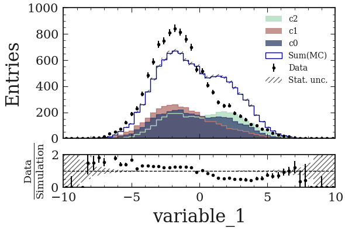

PlotHist
========

**Plot histograms in a scalable way and a beautiful style.**

|img1|      |img2|

.. |img1| image:: img/intro_2dhist_hep.png
   :alt: Complex hep example
   :width: 320

|GitHub Project| |PyPI version| |Docs from latest| |Docs from main| |Code style: black|

Main idea
---------

Major advantages: scalability, style and user friendly way of managing variables.

**First idea**: separate the histogram creation from its data. Then you can easily manage histogram objects (`boostHist` library) and plot large amount of variables and data really fast.

.. code-block:: python

    key = "variable_0"

    fig, ax = plt.subplots()

    h = make_hist(df[key])

    plot_hist(h, ax=ax)

    ax.set_xlabel(key)
    ax.set_ylabel("Entries")

.. image:: img/demo_simple_hist.png
   :alt: Simple hist
   :width: 320

**Second idea**: plot a lot of variable easily with the variable manager

.. code-block:: python

    variable_keys = ["variable_0", "variable_1", "variable_2"]

    create_variable_registry(variable_keys)

will automatically create a `yaml` file with all the plotting information for each variable:

.. code-block:: yaml

    variable_0:
    name: variable_0
    bins: 50
    range:
    - min
    - max
    label: variable_0
    log: false
    legend_location: best
    legend_ncols: 1
    docstring: ''

    variable_1:
        ...

-> Really easy to modify the plotting information.

Then, just get the variable from the registery to make every plots

.. code-block:: python

    # If no range specified for some variable_keys, update the yaml with actual min and max value
    update_variable_registry_ranges(df, variable_keys)

    for variable_key in variable_keys:
        variable = get_variable_from_registry(variable_key)

        fig, ax = plt.subplots()
        h = make_hist(
            df[variable["name"]], bins=variable["bins"], range=variable["range"]
        )
        plot_hist(h, ax=ax)
        ax.set_xlabel(variable["label"])

        ax.set_xlim(variable["range"])
        ax.set_ylabel("Entries")