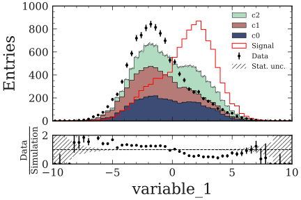
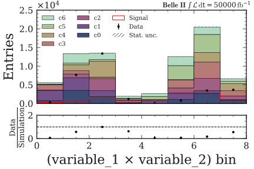
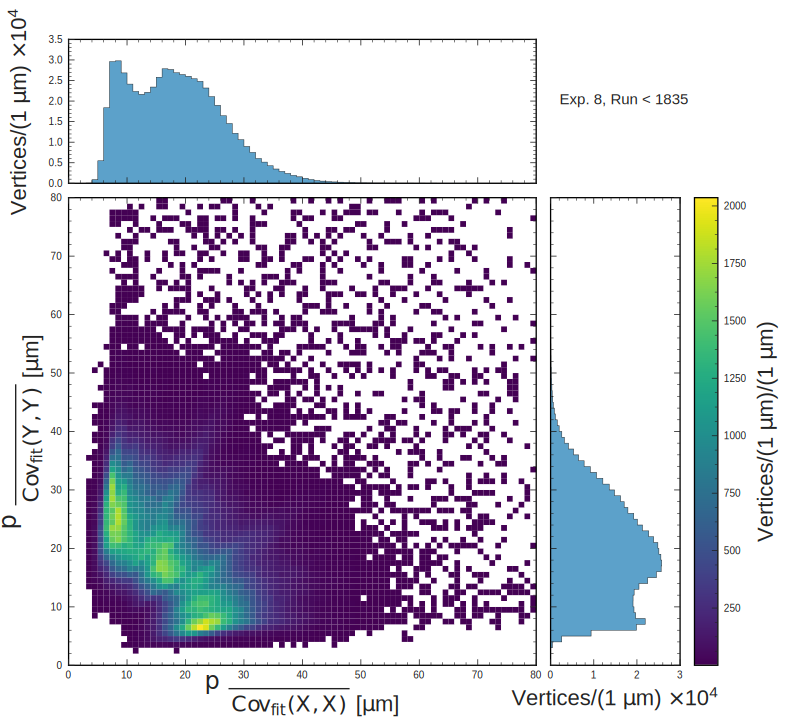

========
plothist
========

**Plot histograms in a scalable way and a beautiful style.**

|img1| |img2|

|GitHub Project| |PyPI version| |Docs from latest| |Docs from main| |Code style: black|

Small presentation
------------------

**Major advantages over other plotting libraries**: scalability, style and user friendly way of managing variables.

1. **First idea**: Default style is already presentation-ready and/or paper-ready (with no effort).

2. **Second idea**: separate the histogram creation from its data. Then you can easily manage histogram objects (``boostHist`` library) and plot large amount of variables and data really fast.

3. **Third idea**: plot a lot of variable easily with a variable manager. Really easy to modify the plotting information and do multiple plots with same variable but different settings

Content
-------

.. toctree::
    :maxdepth: 2

    usage/installation
    basics/1d_hist
    basics/2d_hist
    advanced/hep_examples
    documentation/documentation
   ..  documentation/plotters
   ..  documentation/hep_plotters

.. |GitHub Project| image:: https://img.shields.io/badge/GitHub--blue?style=social&logo=GitHub
   :target: https://github.com/cyrraz/plothist
.. |PyPI version| image:: https://badge.fury.io/py/plothist.svg
   :target: https://badge.fury.io/py/plothist
.. |Code style: black| image:: https://img.shields.io/badge/code%20style-black-000000.svg
   :target: https://github.com/psf/black
.. |Docs from latest| image:: https://img.shields.io/badge/docs-v0.0-blue.svg
   :target: https://plothist.readthedocs.io/
.. |Docs from main| image:: https://img.shields.io/badge/docs-main-blue.svg
   :target: https://plothist.readthedocs.io/en/latest/