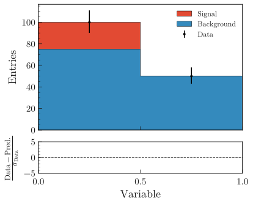
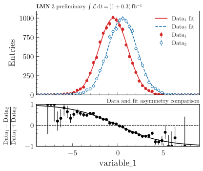

.. _plot-fit-result-label:

====================
Plot result of a fit
====================

This section shows how to plot the result of a fit with ``pyhf``, ``RooFit`` or ``zfit``.

pyhf
****

Here is an example of a fit with ``pyhf``, whose result is then shown using ``plothist``:

.. code-block:: python

   import pyhf
   import numpy as np
   from plothist import make_hist, plot_data_model_comparison

   pyhf.set_backend("numpy")

   # Define model
   data_yield = [100, 50]
   model = pyhf.simplemodels.uncorrelated_background(
       signal=[20, 0.0], bkg=[75.0, 50.0], bkg_uncertainty=[np.sqrt(75.0), np.sqrt(50.0)]
   )
   data = data_yield + model.config.auxdata
   # Maximum likelihood fit
   bestfit_pars = pyhf.infer.mle.fit(data, model)
   # Extract fit results
   model_yields = model.main_model.expected_data(bestfit_pars, return_by_sample=True)

   bins = [0, 0.5, 1.0]
   data_hist = make_hist(bins=bins)
   signal_hist = make_hist(bins=bins)
   background_hist = make_hist(bins=bins)

   # Set explicitly the content and variance of each bin.
   # For the signal and background histograms, we assume no variance.
   data_hist[:] = np.c_[data_yield, data_yield]
   background_hist[:] = np.c_[model_yields[0], [0.0, 0.0]]
   signal_hist[:] = np.c_[model_yields[1], [0.0, 0.0]]

   fig, ax_main, ax_comparison = plot_data_model_comparison(
       data_hist=data_hist,
       stacked_components=[background_hist, signal_hist],
       stacked_labels=["Background", "Signal"],
       model_uncertainty=False,
       xlabel="Variable",
       ylabel="Entries",
       comparison="pull",
   )
   ax_main.set_xticks([0, 0.5, 1.0])
   ax_main.tick_params(axis="x", which="minor", bottom=False, top=False)
   ax_comparison.set_xticks([0, 0.5, 1.0])
   ax_comparison.tick_params(axis="x", which="minor", bottom=False, top=False)

   fig.savefig("pyhf.svg", bbox_inches="tight")

In this trivial case, the pulls are null because the model has enough freedom to perfectly fit the two data points.

RooFit or zfit
**************

Two steps are necessary when you want to use ``plothist`` to plot the result of a fit using ``RooFit`` or ``zfit``.

Getting the PDF
===============

First you need to convert your functions to scipy functions. This can be done using a small function.

With RooFit
-----------

This should be called after you have fitted your model and you have a ``RooAbsPdf`` object.

.. warning::

   For a complex PDF that depends on multiple observables, be sure get the correct PDF projection before calling this function. If it doesn't work, you can use the other method described in :ref:`plot-roofit-canvas-solution-label`.

.. code-block:: python

   import numpy as np
   from scipy.interpolate import interp1d
   import pickle

   def save_pdf(var, pdf, path="pdf.pkl", n_points=10000):
      """
      Save a RooFit PDF as a scipy.interpolate.interp1d function.

      Parameters
      ----------
      var : RooRealVar
         The variable to evaluate the PDF at.
      pdf : RooAbsPdf
         The PDF to save.
      path : str, optional
         The path to save the PDF to. Should end with `.pkl`. Default is "pdf.pkl".
      n_points : int, optional
         The number of points to evaluate the PDF at. Default is 10000.

      Returns
      -------
      pdf_func : scipy.interpolate.interp1d
         The PDF as a function.

      Notes
      -----
      The PDF is saved as a scipy.interpolate.interp1d function with pickle.
      """

      pdf_x = np.zeros(n_points)

      xlim = (var.getMin(), var.getMax())
      # Get a sample of x values
      x = np.linspace(*xlim, n_points)

      for i in range(len(x)):
         var.setVal(x[i])
         # Evaluate the PDF at the given x value
         pdf_x[i] = pdf.getVal(var)

      # Interpolate the PDF
      pdf_func = interp1d(x, pdf_x)

      with open(path, "wb") as f:
         print(f"Saving model to {f.name}")
         pickle.dump(pdf_func, f)

      return pdf_func

With zfit
---------

This should be called after you have fitted your model and you have a ``zfit.pdf.BasePDF`` object.

.. code-block:: python

    from scipy.interpolate import interp1d
    import pickle

    def save_pdf(var, pdf, path="pdf.pkl", n_points=10000):
        """
        Save a PDF from zfit as a callable function.

        Parameters
        ----------
        var : zfit.Space
            The variable to evaluate the PDF at.
        pdf : zfit.pdf.BasePDF
            The PDF to save.
        path : str, optional
            The path to save the PDF to. Default is "pdf.pkl".
        n_points : int, optional
            The number of points to evaluate the PDF at. Default is 10000.

        Returns
        -------
        pdf_func : scipy.interpolate.interp1d

        Notes
        -----
        The PDF is saved as a scipy.interpolate.interp1d function with pickle.
        """

        lower, upper = var.limits
        x = np.linspace(lower[-1][0], upper[0][0], n_points)

        # Evaluate the PDF at the given points
        pdf_x = zfit.run(pdf.pdf(x, norm_range=var))

        # Interpolate the PDF
        pdf_func = interp1d(x, pdf_x)

        with open(path, "wb") as f:
            print(f"Saving model to {f.name}")
            pickle.dump(pdf_func, f)

        return pdf_func

Renormalize the PDF
===================

A ``pdf_func`` you get from a scipy function or from the saved pickle file for ``RooFit`` or ``zfit`` has an area of 1. When you want to plot it, you need to multiply it by the bin width of your histogram, the number of expected events in the range for this PDF and divide by the integral of the PDF in the range. This can be done easily using this small function:

.. code-block:: python

   from scipy.integrate import quad

   def renormalize(pdf, x_range, n_bins, n_data):
      """
      Renormalize a PDF to its corresponding number of data events.

      Parameters
      ----------
      pdf : callable
         The PDF to renormalize.
      x_range : tuple
         The range of the PDF.
      n_bins : int
         The number of bins. Regular binning is assumed.
      n_data : int
         The number of predicted data events in the x_range associated to the pdf.

      Returns
      -------
      pdf : callable
         The renormalized PDF.
      """

      xmin, xmax = x_range
      bin_width = (xmax - xmin) / n_bins
      integral = quad(pdf, xmin, xmax)[0] # If x_range is equal to the full range of the PDF, this is equal to 1.

      def renormalized_pdf(x):
         return pdf(x) * n_data * bin_width / integral

      return renormalized_pdf

Then you can use ``plot_model()`` or ``plot_data_model_comparison()`` (see :ref:`advanced-asymmetry-label`) to plot the PDF and do all sort of comparisons with the ``plothist`` interface:

.. _plot-roofit-canvas-solution-label:
Getting RooFit PDFs from the canvas
===================================

Some PDFs normalization are not easy to get from the RooFit PDF object.
If the two steps above did not work, you can use the canvas to get the PDF.
This solution has the advantage of being already normalized to the data sample.
The disadvantage is that the resulting PDF is bin dependent, so when plotting your data, you need to use the same bins as the ones used to create the canvas.

To get the PDFs from the canvas, you first need plot the desired PDFs on a frame with ``plotOn()``.
Then, you need to save the canvas as a root file with ``canvas.SaveAs("root_file.root")``.
Then you can use the following function to get the PDF:

.. code-block:: python

   import ROOT
   from scipy.interpolate import interp1d

   def get_pdf_list(root_file_name, canvas_name="canvas"):
      # Open the ROOT file
      root_file = ROOT.TFile(root_file_name, "READ")

      # Get the TCanvas from the file
      canvas = root_file.Get(canvas_name)

      pdf_list = []
      pdf_names = []

      ## If you have mutliple pads, you need to specify which one you want to get the PDF from
      # pad = canvas.GetPrimitive("pad_name")
      ## Then loop over the primitives of the pad and not the canvas
      # for obj in pad.GetListOfPrimitives():

      for obj in canvas.GetListOfPrimitives():
         if isinstance(obj, ROOT.TGraph) and not isinstance(obj, ROOT.TGraphAsymmErrors):
               # Get the x and y values of the TGraph
               pdf_names.append(obj.GetName())
               x_values = obj.GetX()
               y_values = obj.GetY()

               # Interpolate the TGraph to get a function
               pdf_func = interp1d(x_values, y_values)

               pdf_list.append(pdf_func)

      print(f"\nPDFs from {root_file_name} saved in the list:")
      for k_name, pdf_name in enumerate(pdf_names):
         print(f"\t[{k_name}] {pdf_name}")
      print()

      return pdf_list

The main idea is that when you do a ``plotOn()`` on a frame, the function is saved as a ``TGraph`` object. You can then get the x and y values of the graph and interpolate it to get a function. The function is then saved in a list with the name of the function. The PDF order in the list is the same as the order you used to plot them on the frame.
