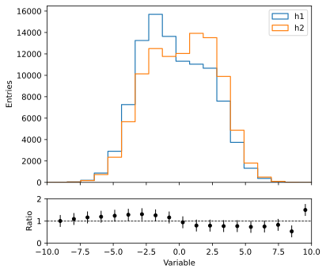
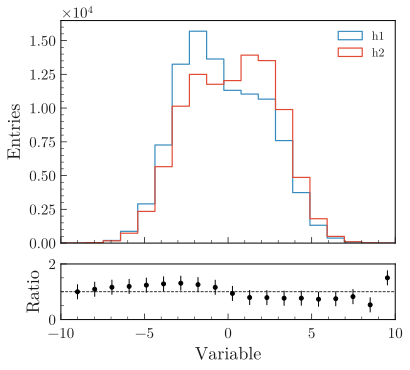

.. _usage-style-label:

=======================
Style, fonts and colors
=======================

Default style
=============

``import plothist`` automatically sets the matplotlib style to a presentation and publication ready style, with large and readable axis labels and legend.

Here are shown two simple comparison plots done with matplotlib functions only. On the left, the default matplotlib style is used. On the right, ``import plothist`` has been added to the same script used to generate the plot on the left:

|img1| |img2|

.. _usage-fonts-label:

Font installation
=================

Latin Modern fonts are used by default (Latin Modern Math, Latin Modern Roman, Latin Modern Sans).

On Linux/Ubuntu/MacOS, you can install the fonts by running on your terminal:

.. code-block:: bash

    install_latin_modern_fonts

Try to restart your python session and run ``import plothist`` again. If no warning is raised, the fonts are installed correctly and you can skip the rest of this section.

Troubleshooting
---------------

If the command doesn't exist, you can run the script manually. First you need to get the folder where ``plothist`` is installed. You can do this by running in a python console:

.. code-block:: python

   import plothist
   plothist.__file__

   > '/path/to/plothist/__init__.py'

Then you can run the following command in a terminal:

.. code-block:: bash

   python3 /path/to/plothist/scripts/install_latin_modern_fonts.py

If the command doesn't work, you may read the detailed procedure directly in the `python script <https://github.com/cyrraz/plothist/blob/main/plothist/scripts/install_latin_modern_fonts.py>`_ called by the command ``install_latin_modern_fonts`` and execute the commands line by line in a terminal.

It was observed in some cases that, after the procedure above, you may need to move the font files ``latinmodern-math.otf``, ``latin-modern-roman/`` and ``latin-modern-sans/`` from ``~/.fonts/`` into another folder. To get an idea of where the fonts are installed on your system, you can run the following commands in a python console:

.. code-block:: python

   from matplotlib import font_manager
   font_manager.findSystemFonts(fontpaths=None, fontext="ttf")

Make also sure to delete the cache of matplotlib, otherwise the fonts may not be loaded correctly. You can delete the cache folder by running in a python console:

.. code-block:: python

   import matplotlib
   import subprocess
   cache_dir = matplotlib.get_cachedir()
   subprocess.run(["rm", "-rv", cache_dir])

Color palettes
==============

Multiple palettes are available in ``plothist`` in order to make beautiful plots. The function ``get_color_palette(cmap, N)`` gets ``N`` different colors from a chosen ``cmap`` colormap.

Default palette
---------------

When no colors are specified for a plot, the default palette of the ``plothist`` style is applied (adapted from `here <https://matplotlib.org/stable/gallery/style_sheets/ggplot.html>`_):

.. image:: ../img/usage_style_cycle.svg
   :alt: Default ggplot palette

To easily get this color palette, the function ``get_color_palette()`` can be used with ``ggplot`` as the argument:

.. code-block:: python

    from plothist import get_color_palette

    colors = get_color_palette("ggplot", 7)

    >>> colors
    ['#348ABD','#E24A33', '#988ED5', '#777777', '#FBC15E', '#8EBA42', '#FFB5B8']

Cubehelix palette
-----------------

When displaying quantities such as yields or intensities, it is recommended to utilize Perceptually Uniform Sequential Colormaps like the cubehelix colormap for accurate representation.

We provide the cubehelix palette (adapted from `here <https://seaborn.pydata.org/generated/seaborn.cubehelix_palette.html>`_) to create such colormap:

.. code-block:: python

    from plothist import get_color_palette

    colors = get_color_palette("cubehelix", 7)

.. image:: ../img/usage_cubehelix.svg
   :alt: Cubehelix example

You can also use the ``cubehelix_palette()`` function to tweak the colormap parameters.

Matplotlib palettes
-------------------

The function ``get_color_palette(cmap, N)`` can also take any ``cmap`` matplotlib color palette and sequence it in ``N`` different colors (see `here <https://matplotlib.org/stable/gallery/color/colormap_reference.html>`_ for the different ``cmap`` names).

We recommand using ``viridis``, ``coolwarm`` or ``YlGnBu_r``:

.. code-block:: python

    from plothist import get_color_palette

    # From model examples
    ...
    background_categories_colors = get_color_palette("Any cmap name", len(background_categories))
    ...

.. image:: ../img/usage_colorpalette_examples.svg
   :alt: Color palette examples

* ``viridis``:

.. image:: ../img/usage_viridis_palette.svg
   :alt: viridis palette

* ``coolwarm``:

.. image:: ../img/usage_coolwarm_palette.svg
   :alt: coolwarm palette

* ``YlGnBu_r``:

.. image:: ../img/usage_YlGnBu_r_palette.svg
   :alt: YlGnBu_r palette

Setting style
=============

If the style is not set automatically by ``import plothist``, you can set it manually with the function ``set_style()``:

.. code-block:: python

    from plothist import set_style
    set_style()

