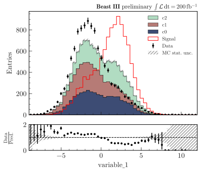

.. _usage-style-label:

=======================
Style, fonts and colors
=======================

Default style
=============

``import plothist`` automatically sets the matplotlib style to a presentation and publication ready style, with large and readable axis labels and legend.

Fonts
=====

Latin Modern fonts are used by default. You can install the fonts by running on your terminal:

On Linux/Ubuntu/MacOS
---------------------

.. code-block:: bash

    plothist_install_fonts

If it doesn't work, you can install the font by using the script located in the `github repository of plothist <https://github.com/cyrraz/plothist/tree/main/scripts/install_latin_modern_fonts.sh>`_.

Color palettes
==============

Multiple palettes are available in ``plothist`` in order to make beautiful plots. The function ``get_color_palette(cmap, N)`` get ``N`` different colors from a chosen ``cmap`` colormap.

Default palette
---------------

When no colors are specified for a plot, the default palette of the ``plothist`` style is applied (adapted from `here <https://matplotlib.org/stable/gallery/style_sheets/ggplot.html>`_):

.. image:: ../img/usage_style_cycle.svg
   :alt: Default ggplot palette

To easily get this color palette, the function ``get_color_palette()`` can be used with ``ggplot`` as the argument:

.. code-block:: python

    from plothist import get_color_palette

    colors = get_color_palette("ggplot", 7)

Cubehelix palette
-----------------

When displaying quantities such as yields or intensities, it is recommended to utilize Perceptually Uniform Sequential Colormaps like the cubehelix colormap for accurate representation.

We provide the cubehelix palette (adapted from `here <https://seaborn.pydata.org/generated/seaborn.cubehelix_palette.html>`_) to create such colormap:

.. code-block:: python

    from plothist import get_color_palette

    colors = get_color_palette("cubehelix", 7)

.. image:: ../img/usage_cubehelix.svg
   :alt: Cubehelix example

You can also use the ``cubehelix_palette()`` function to tweak the colormap parameters.

Matplotlib palettes
-------------------

The function ``get_color_palette(cmap, N)`` can also take any ``cmap`` matplotlib color palette and sequence it in ``N`` different colors (see `here <https://matplotlib.org/stable/gallery/color/colormap_reference.html>`_ for the different ``cmap`` names).

We recommand using ``viridis``, ``coolwarm`` or ``YlGnBu_r``:

.. code-block:: python

    from plothist import get_color_palette

    # From HEP examples
    ...
    background_categories_colors = get_color_palette("Any cmap name", len(background_categories))
    ...

.. image:: ../img/usage_colorpalette_examples.svg
   :alt: Color palette examples

* ``viridis``:

.. image:: ../img/usage_viridis_palette.svg
   :alt: viridis palette

* ``coolwarm``:

.. image:: ../img/usage_coolwarm_palette.svg
   :alt: coolwarm palette

* ``YlGnBu_r``:

.. image:: ../img/usage_YlGnBu_r_palette.svg
   :alt: YlGnBu_r palette

Setting style
=============

To have a small plotting style, you can use:

.. code-block:: python

    from plothist import set_style
    set_style("small")

You can also set both styles in the same script:

.. code-block:: python

    from plothist import set_style
    set_style("small")
    fig, ax = ...

    set_style("default")
    fig, ax = ...

For the first hep example in :ref:`advanced-hep_examples-label`:

Default style:

.. image:: ../img/hep_examples_dataMC_stacked.svg
   :alt: Default style
   :width: 500

Small style:

