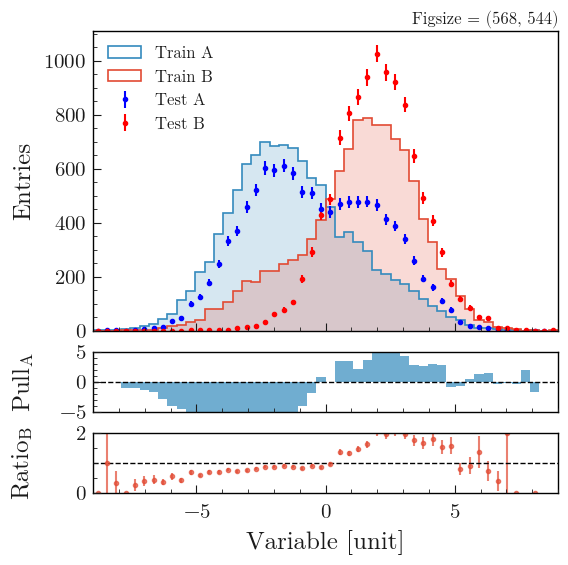
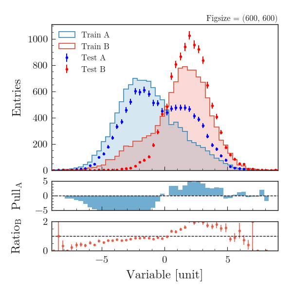

.. _usage-utilities-label:

===================
Utilities functions
===================

Add text
========

``add_text()`` is a useful function to add text to a plot. This function allows you to easily position text either to the left or right and at the top or bottom of your plot, thanks to aliases on the x and y parameters. It ensures that your text remains within the bounds of the plot figure, preventing it from going outside. The function is a wrapper around ``plt.text()``, so you can pass any parameter to it that you would pass to ``plt.text()`` like ``fontsize``, ``color``, ``fontweight``, etc.

.. code-block:: python

    from plothist import add_text

    # Example from 1d comparison difference plot
    add_text("Comparison of two hist with difference plot", ax=ax_main)
    add_text("Difference ax", x="right", ax=ax_comparison)
    ...

.. image:: ../img/1d_comparison_difference.svg
   :alt: Simple difference comparison
   :width: 500

Save figure
===========

When saving a figure, in the majority of the cases doing ``fig.savefig(path, bbox_inches="tight")`` works great. However, it will crop all the unecessary white spaces, which will decrease the final figure size. If you want to have a fix figure size (when putting plots in a LaTeX document for example), the option matplotlib provides is to do ``fig.tight_layout()`` before saving without ``bbox_inches`` argument. This will set the ``figsize`` to the one you specified in ``plt.figure(figsize=(x, y))``, but it will also alter the size and position of the subplots, which can negatively impact the overall appearance of the figure.

``savefig()`` is a function that keep the ``figsize`` you specified, but also keeps the subplots as they are. If the plots are too big for the figure, you can also specify a new ``figsize`` and the subplots will remain the same size and position, while the final figure will be bigger.

For example, from right to left, the first figure is saved with ``bbox_inches="tight"``, the second with ``fig.tight_layout()``, and the third with ``savefig()``:

|img1| |img2| |img3|

.. |img2| image:: ../img/savefig_tight.png
   :alt: With fig.tight_layout() then fig.savefig()
   :width: 300

