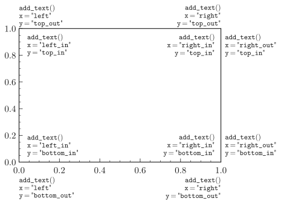

.. _usage-utilities-label:

=================
Utility functions
=================

Add text
========

:func:`add_text() <plothist.plothist_style.add_text>` is a useful function to add text to a plot. It allows you to easily position a text either to the left or right and at the top or bottom of your plot, thanks to aliases on the ``x`` and ``y`` positional parameters. Using them ensures that your text stays aligned to the left or right of the sub-plot (= ax) you specify. The function is a wrapper around ``plt.text()``, so you can pass any parameter to it that you would pass to ``plt.text()`` like ``fontsize``, ``color``, ``fontweight``, etc.

Here are the ``x`` and ``y`` aliases you can use, with their corresponding positions and alignment:

x aliases
---------

.. list-table::
   :header-rows: 1

   * - Alias
     - Value
     - Horizontal alignment (ha)
   * - ``"left"``
     - 0.0
     - ``"left"``
   * - ``"right"``
     - 1.0
     - ``"right"``
   * - ``"left_in"``
     - 0.04
     - ``"left"``
   * - ``"right_in"``
     - 0.97
     - ``"right"``
   * - ``"right_out"``
     - 1.02
     - ``"right"``

y aliases
---------

.. list-table::
   :header-rows: 1

   * - Alias
     - Value
     - Vertical alignment (va)
   * - ``"top" = "top_out"``
     - 1.01
     - ``"bottom"``
   * - ``"bottom" = "bottom_out"``
     - -0.11
     - ``"top"``
   * - ``"top_in"``
     - 0.96
     - ``"bottom"``
   * - ``"bottom_in"``
     - 0.04
     - ``"top"``

Here is an example of good combinations of aliases to add text to a plot:

By default, the text also fits between the sub-plots by specifying the different axes, as shown in the example below:

.. code-block:: python

    from plothist import add_text

    # Example from 1d comparison difference plot
    add_text("Comparison of two hist with difference plot", ax=ax_main)
    add_text("Difference ax", x="right", ax=ax_comparison)
    ...

.. image:: ../img/1d_comparison_difference.svg
   :alt: Simple difference comparison
   :width: 500

Automatic ylabel fontsize
=========================

:func:`set_fitting_ylabel_fontsize(ax) <plothist.plothist_style.set_fitting_ylabel_fontsize>` is a function that will automatically adjust the fontsize of the ylabel so that it fits in the given sub-plot height. It also outputs the fontsize it used, so you can use it to set the same fontsize for other labels.

.. code-block:: python

    from plothist import set_fitting_ylabel_fontsize

    # Example from pull comparison in model section
    set_fitting_ylabel_fontsize(ax_main)
    ...

.. image:: ../img/model_examples_pull_no_model_unc.svg
   :alt: Pull comparison
   :width: 500

Reorder legend entries
======================

The function :func:`plot_reorder_legend(ax, order) <plothist.plothist_style.plot_reordered_legend>` reorders the legend entries of a given plot. It is useful when you want to have a specific order in your legend.

.. code-block:: python

   import matplotlib.pyplot as plt
   from plothist import plot_reordered_legend

   fig, ax = plt.subplots()
   ax.plot([1, 2, 3], label="Line 1")
   ax.plot([3, 2, 1], label="Line 2")

   # To reorder the legend so that 'Line 2' comes first, use:
   plot_reordered_legend(ax, [1, 0])

.. warning::

   We recommend to not alter the order of the legend entries for stacked histograms. By default in ``plothist``, the legend entries are ordered in the same way as the plots are stacked, which improves readability.

Save figure
===========

When saving a figure, doing ``fig.savefig(path, bbox_inches="tight")`` works great. It will crop all the unnecessary white space by reducing the final figure size. We recommend this way to save a figure.

If you want to have a fixed figure size (e.g. when putting plots into a LaTeX document), the option matplotlib provides is to call ``fig.tight_layout()`` then saving without ``bbox_inches`` argument. This will keep the figure size to the default value or the value you specify in ``plt.figure()``, but it will also change the size and position of the sub-plots, which usually have a negative effect on the overall appearance of the figure.

``savefig(fig, path)`` is a function that keeps the ``figsize`` you specify, but also keeps the sub-plots as they are. If the sub-plots are too big for the figure, you need to specify a larger ``figsize`` and the sub-plots will remain the same size and position, while the final figure will be larger.

For example, below is shown a plot saved with ``fig.savefig(path, bbox_inches="tight")``, then with ``fig.tight_layout()`` and saved with ``fig.savefig(path)``, and finally with ``savefig(fig, path)`` from ``plothist``:

.. only:: html

   .. figure:: ../img/savefig_comparisons.gif
