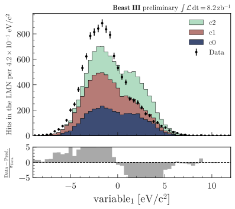

.. _usage-utilities-label:

=================
Utility functions
=================

Add text
========

``add_text()`` is a useful function to add text to a plot. It allows you to easily position text either to the left or right and at the top or bottom of your plot, thanks to aliases on the x and y parameters. Using them will ensure that your text stays aligned to the left or right of the sub-plot (= ax) you specify. The function is a wrapper around ``plt.text()``, so you can pass any parameter to it that you would pass to ``plt.text()`` like ``fontsize``, ``color``, ``fontweight``, etc.

.. code-block:: python

    from plothist import add_text

    # Example from 1d comparison difference plot
    add_text("Comparison of two hist with difference plot", ax=ax_main)
    add_text("Difference ax", x="right", ax=ax_comparison)
    ...

.. image:: ../img/1d_comparison_difference.svg
   :alt: Simple difference comparison
   :width: 500

Automatic ylabel fontsize
=========================

``set_fitting_ylabel_fontsize(ax)`` is a function that will automatically adjust the fontsize of the ylabel so that it fits in the given sub-plot height. It also output the fontsize it used, so you can use it to set the same fontsize for other labels.

.. code-block:: python

    from plothist import set_fitting_ylabel_fontsize

    # Example from pull comparion in HEP section
    set_fitting_ylabel_fontsize(ax_main)
    ...

Save figure
===========

When saving a figure, doing ``fig.savefig(path, bbox_inches="tight")`` works great. It will crop all the unnecessary white space by reducing the final figure size.

If you want to have a fixed figure size (e.g. when putting plots into a LaTeX document), the option matplotlib provides is to call ``fig.tight_layout()`` then saving without ``bbox_inches`` argument. This will keep the figure size to the default value or the value you specify in ``plt.figure()``, but it will also change the size and position of the sub-plots, which usually have a negative effect on the overall appearance of the figure.

``savefig(fig, path)`` is a function that keeps the ``figsize`` you specify, but also keeps the sub-plots as they are. If the sub-plots are too big for the figure, you can also specify a new ``figsize`` and the sub-plots will remain the same size and position, while the final figure will be larger.

For example, below is shown a plot saved with ``fig.savefig(path, bbox_inches="tight")``, then with ``fig.tight_layout()`` and saved with ``fig.savefig(path)``, and finally with ``savefig(fig, path)`` from ``plothist``:

.. only:: html

   .. figure:: ../img/savefig_comparisons.gif